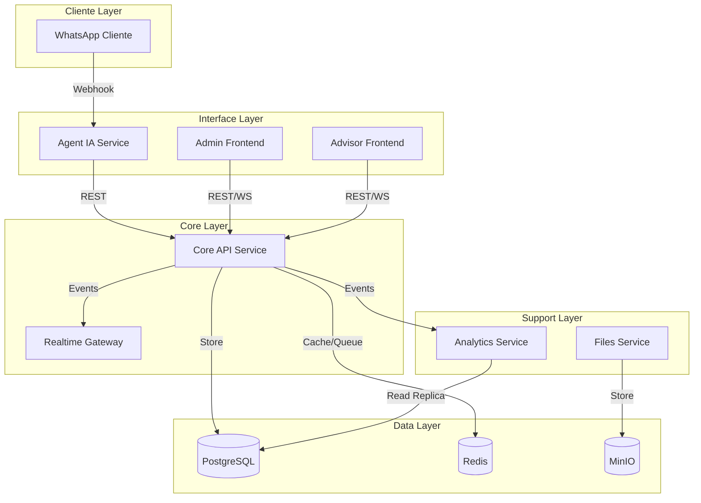
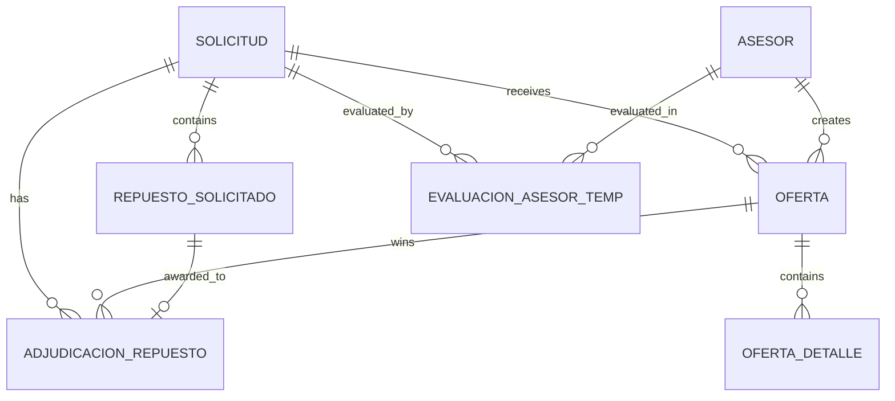

# Design Document

## Overview

TeLOO V3 es un marketplace inteligente de repuestos automotrices que conecta clientes con asesores/proveedores mediante un sistema automatizado de distribución, evaluación y adjudicación de ofertas. El sistema se compone de microservicios independientes que trabajan en conjunto para proporcionar una experiencia fluida y optimizada.

### Principios de Diseño

1. **Autonomía**: El sistema opera de manera independiente sin dependencias externas innecesarias
2. **Escalabilidad**: Arquitectura de microservicios que permite escalar componentes individualmente
3. **Transparencia**: Algoritmos configurables y auditables en cada paso del proceso
4. **Optimización Geográfica**: Distribución inteligente basada en proximidad y desempeño
5. **Evaluación Justa**: Sistema de puntuación objetivo por repuesto individual

## Architecture

### High-Level Architecture



### Technology Stack

| Component | Technology | Justification |
|-----------|------------|---------------|
| Core API | FastAPI (Python 3.11) | Alto rendimiento async, tipado fuerte, OpenAPI automático |
| Agent IA | FastAPI + Multi-LLM | Deepseek, Ollama, Gemini, OpenAI, Anthropic |
| Frontend | React + Vite + Tailwind | Desarrollo rápido, componentes reutilizables |
| Database | PostgreSQL 15+ | ACID, JSON support, extensibilidad |
| Cache/Queue | Redis 7+ | Pub/sub, locks distribuidos, cache de alto rendimiento |
| Storage | MinIO | S3-compatible, self-hosted |
| ORM | Tortoise ORM | Async nativo, migraciones automáticas |

## Components and Interfaces

### 1. Agent IA Service

**Responsabilidad**: Interfaz conversacional con clientes vía WhatsApp con procesamiento NLP inteligente

**Componentes Internos**:
- `WhatsAppWebhookHandler`: Recibe y valida mensajes entrantes
- `LLMProviderService`: Servicio unificado de múltiples proveedores LLM
- `LLMRouter`: Selección automática de proveedor basada en complejidad
- `ComplexityAnalyzer`: Clasifica contenido por nivel de complejidad
- `ConversationManager`: Mantiene contexto de conversaciones
- `MessageFormatter`: Formatea respuestas para WhatsApp
- `FileProcessor`: Procesa archivos multimedia (Excel, audio, imágenes)

**Arquitectura de Múltiples Proveedores LLM**:
```python
class LLMProviderService:
    # Nivel 1: Texto simple (costo bajo)
    deepseek_adapter: DeepseekAdapter
    ollama_adapter: OllamaAdapter  # Local, gratis
    
    # Nivel 2: Texto complejo (costo medio)
    gemini_adapter: GeminiAdapter
    
    # Nivel 3: Documentos estructurados (costo alto)
    openai_adapter: OpenAIAdapter  # GPT-4
    
    # Nivel 4: Contenido multimedia (costo premium)
    anthropic_adapter: AnthropicAdapter  # Claude Vision
    
    async def process_content(content, complexity_level) -> ProcessedData
    async def get_best_provider(complexity_level) -> LLMAdapter
```

**Sistema de Fallback en Cascada**:
```
Regex → Deepseek → Gemini → OpenAI → Anthropic → Procesamiento Básico
```

**APIs Expuestas**:
```python
POST /v1/webhooks/whatsapp
  - Recibe mensajes de WhatsApp
  - Clasifica complejidad automáticamente
  - Procesa con proveedor LLM óptimo
  - Crea/actualiza solicitudes

POST /v1/messages/send
  - Envía mensajes a clientes
  - Formatea según tipo (oferta única/mixta)

POST /v1/files/process
  - Procesa archivos multimedia
  - Selecciona proveedor según tipo de archivo
  - Extrae información estructurada

GET /v1/llm/metrics
  - Métricas de uso por proveedor
  - Costos, latencia, precisión
```

**Integraciones**:
- WhatsApp Business API (Meta)
- Deepseek API (texto simple)
- Ollama Local (texto simple, gratis)
- Google Gemini API (texto complejo)
- OpenAI GPT-4 API (documentos estructurados)
- Anthropic Claude API (contenido multimedia)
- Core API (REST)

### 2. Core API Service

**Responsabilidad**: Motor central del sistema - gestión de solicitudes, ofertas, evaluación y escalamiento

**Módulos Principales**:

#### 2.1 Solicitudes Module
```python
class SolicitudService:
    async def create_solicitud(data: SolicitudCreate) -> Solicitud
    async def get_solicitud(id: UUID) -> Solicitud
    async def update_estado(id: UUID, estado: EstadoSolicitud)
    async def escalar_nivel(id: UUID)
```

#### 2.2 Sistema de Escalamiento Module
```python
class EscalamientoService:
    async def determinar_asesores_elegibles(solicitud: Solicitud) -> List[Asesor]
    async def calcular_puntaje_asesor(asesor: Asesor, solicitud: Solicitud) -> float
    async def clasificar_por_niveles(asesores: List[Asesor]) -> Dict[int, List[Asesor]]
    async def ejecutar_oleada(solicitud: Solicitud, nivel: int)
    async def verificar_cierre_anticipado(solicitud: Solicitud) -> bool
```

#### 2.3 Ofertas Module
```python
class OfertaService:
    async def create_oferta(data: OfertaCreate) -> Oferta
    async def upload_oferta_excel(file: UploadFile, solicitud_id: UUID) -> OfertaResult
    async def validate_oferta(oferta: Oferta) -> ValidationResult
    async def get_ofertas_by_solicitud(solicitud_id: UUID) -> List[Oferta]
```

#### 2.4 Evaluación Module
```python
class EvaluacionService:
    async def evaluar_solicitud(solicitud_id: UUID) -> ResultadoEvaluacion
    async def calcular_puntaje_oferta(oferta: Oferta, repuesto: Repuesto) -> float
    async def aplicar_regla_cobertura(ofertas: List[Oferta]) -> List[Oferta]
    async def generar_adjudicaciones(solicitud: Solicitud) -> List[Adjudicacion]
```

**APIs Expuestas**:
```python
# Solicitudes
POST /v1/solicitudes
GET /v1/solicitudes/{id}
GET /v1/solicitudes?estado={estado}&page={page}

# Ofertas
POST /v1/ofertas
POST /v1/ofertas/upload
GET /v1/ofertas/{id}
GET /v1/ofertas?solicitud_id={id}

# Evaluación
POST /v1/evaluaciones/{solicitud_id}/run
GET /v1/evaluaciones/{solicitud_id}

# Asesores
GET /v1/asesores
POST /v1/asesores
PUT /v1/asesores/{id}
GET /v1/asesores/{id}/metricas
```

### 3. Analytics Service

**Responsabilidad**: Métricas, dashboards y reportes del sistema

> **Responsabilidad Principal**: Este servicio es el único responsable de calcular y generar los 34 KPIs del sistema. El Core API NO calcula métricas, solo publica eventos que Analytics consume.

**Componentes**:
- `EventCollector`: Captura eventos de Redis pub/sub desde Core API
- `MetricsCalculator`: Calcula los 34 KPIs usando estrategia híbrida (tiempo real, cache, batch)
- `DashboardGenerator`: Genera datos para los 4 dashboards
- `AlertManager`: Gestiona alertas por umbrales configurables

**Fuente de Datos**:
- Lee de **réplica de lectura** de PostgreSQL (no impacta BD principal)
- Consume eventos en tiempo real desde Redis pub/sub
- Usa Redis para cache de métricas frecuentes

**Dashboards Generados**:
1. Embudo Operativo (11 KPIs)
2. Salud del Marketplace (5 KPIs)
3. Dashboard Financiero (5 KPIs)
4. Análisis de Asesores (13 KPIs)

### 4. Realtime Gateway

**Responsabilidad**: Comunicación WebSocket en tiempo real

**Funcionalidades**:
- Conexión persistente con clientes web
- Broadcasting de eventos por roles
- Notificaciones push a asesores
- Sincronización de estado en tiempo real

### 5. Files Service

**Responsabilidad**: Gestión de archivos (Excel de ofertas)

**Componentes**:
- `FileValidator`: Valida formato y tamaño
- `ExcelParser`: Parsea ofertas desde Excel
- `AntivirusScanner`: Escanea archivos con ClamAV
- `StorageManager`: Gestiona almacenamiento en MinIO

### 6. Frontend Design System

**Tema Visual**: Amber Minimal Theme para shadcn/ui

**Instalación**:
```bash
npx shadcn@latest add https://tweakcn.com/r/themes/amber-minimal.json
```

**Características del Tema**:
- **Color Primario**: Amber/Orange (#F59E0B) - Representa energía y confianza
- **Tipografía**: Inter (sans-serif), Source Serif 4 (serif), JetBrains Mono (monospace)
- **Esquema**: Light/Dark mode automático
- **Sombras**: Sutiles y consistentes para profundidad
- **Bordes**: Redondeados (0.375rem) para suavidad

**Paleta de Colores**:
```css
/* Modo Claro */
--primary: 37.6923 92.1260% 50.1961%;     /* Amber principal */
--secondary: 220.0000 14.2857% 95.8824%;  /* Gris claro */
--accent: 48.0000 100.0000% 96.0784%;     /* Amber muy claro */
--muted: 210 20.0000% 98.0392%;           /* Fondo sutil */

/* Modo Oscuro */
--primary: 37.6923 92.1260% 50.1961%;     /* Amber (mismo)*/
--secondary: 0 0% 14.9020%;               /* Gris oscuro */
--accent: 22.7273 82.5000% 31.3725%;     /* Amber oscuro */
--background: 0 0% 9.0196%;               /* Fondo negro */
```

**Componentes UI Principales**:
- **Cards**: Fondo blanco/gris oscuro con sombras sutiles
- **Buttons**: Amber primario con hover states
- **Tables**: Zebra striping con hover highlighting
- **Charts**: Paleta de 5 colores amber/orange coordinados
- **Sidebar**: Fondo muted con accent highlights
- **Forms**: Inputs con border amber en focus

**Responsive Breakpoints**:
```css
/* Mobile First */
sm: 640px   /* Tablets */
md: 768px   /* Desktop pequeño */
lg: 1024px  /* Desktop */
xl: 1280px  /* Desktop grande */
2xl: 1536px /* Ultra wide */
```

### 7. Multi-LLM Provider Architecture

#### 7.1 Estrategia de Selección por Complejidad

**Clasificación Automática de Complejidad**:
```python
class ComplexityAnalyzer:
    def analyze_content(self, content: str, attachments: List[File]) -> ComplexityLevel:
        # Nivel 1: Texto simple
        if self.is_simple_text(content):
            return ComplexityLevel.SIMPLE
        
        # Nivel 2: Texto complejo
        if self.is_complex_text(content):
            return ComplexityLevel.COMPLEX
        
        # Nivel 3: Documentos estructurados
        if self.has_structured_documents(attachments):
            return ComplexityLevel.STRUCTURED
        
        # Nivel 4: Contenido multimedia
        if self.has_multimedia_content(attachments):
            return ComplexityLevel.MULTIMEDIA
```

**Matriz de Proveedores por Complejidad**:

| Nivel | Tipo de Contenido | Proveedor Principal | Proveedor Fallback | Costo Relativo |
|-------|-------------------|--------------------|--------------------|-----------------|
| 1 | Texto simple | Deepseek | Ollama (local) | 💰 (Bajo) |
| 2 | Texto complejo | Gemini | Deepseek | 💰💰 (Medio) |
| 3 | Documentos Excel/PDF | OpenAI GPT-4 | Gemini | 💰💰💰 (Alto) |
| 4 | Audio/Imágenes | Anthropic Claude | OpenAI GPT-4V | 💰💰💰💰 (Premium) |

#### 7.2 Implementación de Adaptadores

**Interfaz Unificada**:
```python
class LLMAdapter(ABC):
    @abstractmethod
    async def process_text(self, text: str, context: Dict) -> ProcessedData
    
    @abstractmethod
    async def process_file(self, file: File, context: Dict) -> ProcessedData
    
    @abstractmethod
    def get_cost_estimate(self, input_size: int) -> float
    
    @abstractmethod
    def get_capabilities(self) -> List[Capability]
```

**Adaptadores Específicos**:
```python
class DeepseekAdapter(LLMAdapter):
    # Optimizado para texto simple, costo bajo
    base_url = "https://api.deepseek.com/v1"
    model = "deepseek-chat"
    cost_per_token = 0.00014  # Muy bajo costo

class OllamaAdapter(LLMAdapter):
    # Local, gratis, para casos simples
    base_url = "http://localhost:11434"
    model = "llama3.1:8b"
    cost_per_token = 0.0  # Gratis

class GeminiAdapter(LLMAdapter):
    # Google AI, costo medio, bueno para texto complejo
    base_url = "https://generativelanguage.googleapis.com/v1"
    model = "gemini-1.5-pro"
    cost_per_token = 0.00125

class OpenAIAdapter(LLMAdapter):
    # GPT-4, costo alto, excelente para documentos
    base_url = "https://api.openai.com/v1"
    model = "gpt-4o"
    cost_per_token = 0.03

class AnthropicAdapter(LLMAdapter):
    # Claude, costo premium, mejor para multimedia
    base_url = "https://api.anthropic.com/v1"
    model = "claude-3-5-sonnet-20241022"
    cost_per_token = 0.015
```

#### 7.3 Sistema de Métricas y Optimización

**Métricas por Proveedor**:
```python
class LLMMetrics:
    provider_name: str
    total_requests: int
    success_rate: float
    avg_latency_ms: float
    total_cost_usd: float
    accuracy_score: float  # Basado en validación humana
    availability_pct: float
    
class MetricsCollector:
    async def record_request(self, provider: str, latency: float, cost: float, success: bool)
    async def get_provider_ranking(self) -> List[ProviderRanking]
    async def optimize_provider_selection(self) -> Dict[ComplexityLevel, str]
```

#### 7.4 Circuit Breaker y Fallback

**Implementación de Resiliencia**:
```python
class LLMCircuitBreaker:
    def __init__(self, failure_threshold=3, timeout_seconds=300):
        self.failure_threshold = failure_threshold
        self.timeout_seconds = timeout_seconds
        self.failure_count = 0
        self.last_failure_time = None
        self.state = CircuitState.CLOSED
    
    async def call_with_circuit_breaker(self, provider_func):
        if self.state == CircuitState.OPEN:
            if self._should_attempt_reset():
                self.state = CircuitState.HALF_OPEN
            else:
                raise CircuitBreakerOpenError()
        
        try:
            result = await provider_func()
            self._on_success()
            return result
        except Exception as e:
            self._on_failure()
            raise
```

### 8. Frontend Structure and Layout

#### 7.1 Admin Frontend Structure

**Layout Principal**:
```
┌─────────────────────────────────────────────────────────┐
│ Header: Logo TeLOO + User Menu + Notifications         │
├─────────────┬───────────────────────────────────────────┤
│ Sidebar     │ Main Content Area                         │
│             │                                           │
│ INICIO      │ ┌─────────────────────────────────────┐   │
│ ASESORES    │ │ Dashboard Principal                 │   │
│ REPORTES    │ │ - 4 KPIs superiores                │   │
│ PQR         │ │ - Gráficos del mes                 │   │
│ CONFIG      │ │ - Top 15 solicitudes abiertas      │   │
│             │ └─────────────────────────────────────┘   │
└─────────────┴───────────────────────────────────────────┘
```

**Módulos del Sidebar**:

1. **INICIO (Dashboard Principal)**
   - 4 KPIs superiores: Ofertas totales asignadas, Monto total aceptado, Solicitudes abiertas, Tasa de conversión
   - Gráficos de líneas: Solicitudes por día, Aceptadas por día, Cerradas sin ofertas
   - Tabla: Top 15 solicitudes abiertas con mayor tiempo en proceso

2. **ASESORES (Gestión Completa)**
   - 3 KPIs superiores: Total asesores habilitados, Total puntos de venta, Cobertura nacional
   - Tabla de asesores: Nombre, teléfono, correo, punto de venta, ubicación, estado, calificaciones
   - Acciones: Importar/Exportar Excel, Crear nuevo asesor, Editar, Suspender/Activar

3. **REPORTES Y ANALYTICS (4 Dashboards)**
   - **Embudo Operativo** (11 KPIs): Solicitudes creadas, ofertas recibidas, evaluaciones, conversiones
   - **Salud del Marketplace** (5 KPIs): Tiempo promedio respuesta, cobertura geográfica, satisfacción
   - **Dashboard Financiero** (5 KPIs): Volumen transaccional, ticket promedio, comisiones
   - **Análisis de Asesores** (13 KPIs): Performance individual, rankings, métricas de calidad

4. **PQR (Atención al Cliente)**
   - Lista de PQR por estado: Abiertas, En proceso, Cerradas
   - Formulario de respuesta y seguimiento
   - Métricas de tiempo de resolución

5. **CONFIGURACIÓN (Sistema)**
   - **Parámetros del Sistema**: Todos los valores configurables (pesos, umbrales, tiempos)
   - **Roles y Permisos**: Gestión de usuarios y accesos
   - **Integración**: Configuración de APIs externas (WhatsApp, LLM)

**Componentes Reutilizables**:
```typescript
// KPI Card Component
interface KPICardProps {
  title: string;
  value: string | number;
  change?: number;
  trend?: 'up' | 'down' | 'neutral';
  icon?: React.ReactNode;
}

// Data Table Component
interface DataTableProps<T> {
  data: T[];
  columns: ColumnDef<T>[];
  searchable?: boolean;
  filterable?: boolean;
  exportable?: boolean;
}

// Chart Components
interface LineChartProps {
  data: ChartData[];
  xKey: string;
  yKey: string;
  title: string;
}
```

#### 7.2 Advisor Frontend Structure

**Layout Principal**:
```
┌─────────────────────────────────────────────────────────┐
│ Header: Logo TeLOO + Asesor Info + Notifications       │
├─────────────────────────────────────────────────────────┤
│ Dashboard KPIs (4 superiores)                          │
│ Ofertas asignadas | Monto ganado | Abiertas | Tasa     │
├─────────────────────────────────────────────────────────┤
│ Tabs Navigation                                         │
│ [ABIERTAS] [CERRADAS] [GANADAS]                        │
├─────────────────────────────────────────────────────────┤
│ Content Area                                            │
│ ┌─────────────────────────────────────────────────────┐ │
│ │ Lista de Solicitudes según tab activo               │ │
│ │ - Cards con información de repuestos                │ │
│ │ - Botones de acción (Ofertar, Ver detalles)        │ │
│ └─────────────────────────────────────────────────────┘ │
└─────────────────────────────────────────────────────────┘
```

**Pestañas del Asesor**:

1. **ABIERTAS (Solicitudes Disponibles)**
   - Cards de solicitudes con tiempo restante
   - Información del vehículo y repuestos
   - Botón "Hacer Oferta" → Modal o página de oferta
   - Botón "Carga Masiva Excel" → Upload component

2. **CERRADAS (Solicitudes Finalizadas sin Ganar)**
   - Historial de solicitudes no adjudicadas
   - Razón de no selección
   - Análisis de competencia (opcional)

3. **GANADAS (Solicitudes Adjudicadas)**
   - Ofertas ganadoras con estado del cliente
   - Información de contacto del cliente (si aceptada)
   - Seguimiento de entrega

**Modal de Oferta Individual**:
```
┌─────────────────────────────────────────────────────────┐
│ Crear Oferta - Solicitud #SOL-001                      │
├─────────────────────────────────────────────────────────┤
│ Información del Vehículo:                              │
│ Toyota Corolla 2015                                     │
├─────────────────────────────────────────────────────────┤
│ Repuestos Solicitados:                                  │
│                                                         │
│ 1. Pastillas de freno delanteras                       │
│    Precio: [_______] COP                               │
│    Garantía: [__] meses                                │
│    ☑ Incluir en oferta                                 │
│                                                         │
│ 2. Discos de freno                                     │
│    Precio: [_______] COP                               │
│    Garantía: [__] meses                                │
│    ☐ Incluir en oferta                                 │
├─────────────────────────────────────────────────────────┤
│ Tiempo de entrega total: [__] días                     │
│ Observaciones: [________________]                       │
├─────────────────────────────────────────────────────────┤
│           [Cancelar]  [Enviar Oferta]                  │
└─────────────────────────────────────────────────────────┘
```

**Componente de Carga Masiva**:
```typescript
interface ExcelUploadProps {
  solicitudId: string;
  onSuccess: (result: UploadResult) => void;
  onError: (errors: string[]) => void;
}

// Flujo:
// 1. Descargar template Excel
// 2. Drag & drop o seleccionar archivo
// 3. Validación en tiempo real
// 4. Preview de datos
// 5. Confirmación y envío
```

#### 7.3 Responsive Design Strategy

**Mobile-First Approach**:
- **Mobile (< 640px)**: Stack vertical, sidebar colapsable
- **Tablet (640px - 1024px)**: Sidebar overlay, contenido adaptado
- **Desktop (> 1024px)**: Layout completo con sidebar fijo

**Componentes Adaptativos**:
```typescript
// Responsive Table
const ResponsiveTable = ({ data, columns }) => {
  const isMobile = useMediaQuery('(max-width: 640px)');
  
  return isMobile ? 
    <CardList data={data} /> : 
    <DataTable data={data} columns={columns} />;
};

// Responsive Navigation
const Navigation = () => {
  const [sidebarOpen, setSidebarOpen] = useState(false);
  const isMobile = useMediaQuery('(max-width: 768px)');
  
  return isMobile ? 
    <MobileNav isOpen={sidebarOpen} onToggle={setSidebarOpen} /> :
    <DesktopSidebar />;
};
```

## Data Models

### Core Entities

```python
# Solicitud
class Solicitud(Model):
    id: UUID
    cliente_id: UUID
    estado: EstadoSolicitud  # ABIERTA, EVALUADA, ACEPTADA, RECHAZADA, EXPIRADA, CERRADA_SIN_OFERTAS
    nivel_actual: int  # 1-5
    ciudad_origen: str
    departamento_origen: str
    metadata_json: dict
    created_at: datetime
    updated_at: datetime

# Repuesto Solicitado
class RepuestoSolicitado(Model):
    id: UUID
    solicitud_id: UUID
    nombre: str
    codigo: str
    marca_vehiculo: str
    linea_vehiculo: str
    anio_vehiculo: int
    cantidad: int
    observaciones: str

# Asesor
class Asesor(Model):
    id: UUID
    usuario_id: UUID
    ciudad_id: int
    confianza: Decimal  # 1.0-5.0
    nivel_actual: int  # 1-5
    estado: EstadoAsesor  # ACTIVO, INACTIVO, SUSPENDIDO
    actividad_reciente_pct: Decimal  # 0-100
    desempeno_historico_pct: Decimal  # 0-100

# Oferta
class Oferta(Model):
    id: UUID
    solicitud_id: UUID
    asesor_id: UUID
    tiempo_entrega_dias: int
    observaciones: str
    estado: EstadoOferta  # ENVIADA, GANADORA, NO_SELECCIONADA, EXPIRADA, RECHAZADA, ACEPTADA
    created_at: datetime
    updated_at: datetime

# Detalle de Oferta
class OfertaDetalle(Model):
    id: UUID
    oferta_id: UUID
    repuesto_solicitado_id: UUID
    precio_unitario: Decimal
    cantidad: int
    garantia_meses: int
    tiempo_entrega_dias: int
    origen: str  # FORM, EXCEL

# Adjudicación por Repuesto
class AdjudicacionRepuesto(Model):
    id: UUID
    solicitud_id: UUID
    oferta_id: UUID
    repuesto_solicitado_id: UUID
    puntaje_obtenido: Decimal
    precio_adjudicado: Decimal
    tiempo_entrega_adjudicado: int
    garantia_adjudicada: int
    created_at: datetime
```

### Supporting Tables

```python
# Áreas Metropolitanas
class AreaMetropolitana(Model):
    id: UUID
    area_metropolitana: str
    ciudad_nucleo: str
    municipio_norm: str

# Hubs Logísticos
class HubLogistico(Model):
    id: UUID
    municipio_norm: str
    hub_asignado_norm: str

# Evaluación Temporal de Asesores
class EvaluacionAsesorTemp(Model):
    id: UUID
    solicitud_id: UUID
    asesor_id: UUID
    proximidad: Decimal
    actividad_reciente_5: Decimal
    desempeno_historico_5: Decimal
    nivel_confianza: Decimal
    puntaje_total: Decimal
    nivel_entrega: int
    canal: str
    tiempo_espera_min: int

# Parámetros de Configuración
class ParametroConfig(Model):
    clave: str  # PK
    valor_json: dict
    updated_at: datetime
```

### Analytics and Metrics Tables

```python
# Historial de Respuestas (para actividad reciente)
class HistorialRespuestaOferta(Model):
    id: UUID
    asesor_id: UUID
    solicitud_id: UUID
    fecha_envio: datetime
    fecha_vista: datetime
    respondio: bool
    tiempo_respuesta_seg: int
    created_at: datetime

# Ofertas Históricas (para desempeño histórico)
class OfertaHistorica(Model):
    id: UUID
    asesor_id: UUID
    solicitud_id: UUID
    fecha: datetime
    adjudicada: bool
    aceptada_cliente: bool
    entrega_exitosa: bool
    tiempo_respuesta_seg: int
    monto_total: Decimal
    created_at: datetime

# Auditoría de Tiendas (para nivel de confianza)
class AuditoriaTienda(Model):
    id: UUID
    asesor_id: UUID
    fecha_revision: datetime
    estado: str  # APROBADA, OBSERVACIONES, RECHAZADA
    puntaje_confianza: Decimal  # 1.0-5.0
    observaciones: str
    auditor_id: UUID
    created_at: datetime

# Eventos del Sistema (para analytics en tiempo real)
class EventoSistema(Model):
    id: UUID
    tipo_evento: str
    entidad: str
    entidad_id: UUID
    datos_evento: dict
    usuario_id: UUID
    ip_address: str
    user_agent: str
    created_at: datetime

# Métricas Calculadas (cache para dashboards)
class MetricaCalculada(Model):
    id: UUID
    nombre_metrica: str
    periodo: str  # diario, semanal, mensual
    fecha_periodo: date
    valor_numerico: Decimal
    valor_json: dict
    calculado_at: datetime

# PQR (Peticiones, Quejas, Reclamos)
class PQR(Model):
    id: UUID
    cliente_id: UUID
    tipo: str  # PETICION, QUEJA, RECLAMO
    prioridad: str  # BAJA, MEDIA, ALTA, CRITICA
    estado: str  # ABIERTA, EN_PROCESO, CERRADA
    resumen: str
    detalle: str
    created_at: datetime

# Notificaciones del Sistema
class Notificacion(Model):
    id: UUID
    usuario_id: UUID
    tipo: str
    titulo: str
    mensaje: str
    leida: bool
    datos_adicionales: dict
    created_at: datetime

# Sesiones de Usuario (para analytics de uso)
class SesionUsuario(Model):
    id: UUID
    usuario_id: UUID
    inicio_sesion: datetime
    fin_sesion: datetime
    ip_address: str
    user_agent: str
    duracion_seg: int
    acciones_realizadas: int

# Transacciones Financieras (para KPIs financieros)
class Transaccion(Model):
    id: UUID
    solicitud_id: UUID
    asesor_id: UUID
    tipo: str  # VENTA, COMISION, DEVOLUCION
    monto: Decimal
    estado: str  # PENDIENTE, COMPLETADA, FALLIDA
    fecha_transaccion: datetime
    referencia_externa: str
    metadata_json: dict

# Logs de Auditoría (para trazabilidad completa)
class LogAuditoria(Model):
    id: UUID
    actor_id: UUID
    accion: str
    entidad: str
    entidad_id: UUID
    diff_json: dict
    ts: datetime
```

### KPI Coverage Analysis

**Las tablas soportan los 34 KPIs distribuidos en 4 dashboards:**

#### Dashboard 1: Embudo Operativo (11 KPIs)
1. **Solicitudes creadas** → `solicitudes.created_at`
2. **Ofertas recibidas** → `ofertas.created_at`
3. **Evaluaciones completadas** → `evaluaciones.created_at`
4. **Ofertas ganadoras** → `ofertas.estado = 'GANADORA'`
5. **Ofertas aceptadas** → `ofertas.estado = 'ACEPTADA'`
6. **Tasa de conversión** → `aceptadas / creadas`
7. **Tiempo promedio evaluación** → `evaluaciones.duracion_ms`
8. **Solicitudes sin ofertas** → `solicitudes.estado = 'CERRADA_SIN_OFERTAS'`
9. **Ofertas por solicitud** → `COUNT(ofertas) / COUNT(solicitudes)`
10. **Escalamientos por nivel** → `evaluacion_asesores_temp.nivel_entrega`
11. **Cobertura geográfica** → `DISTINCT(solicitudes.ciudad_origen)`

#### Dashboard 2: Salud del Marketplace (5 KPIs)
1. **Tiempo respuesta asesores** → `historial_respuestas_ofertas.tiempo_respuesta_seg`
2. **Tasa de participación** → `historial_respuestas_ofertas.respondio`
3. **Asesores activos** → `asesores.estado = 'ACTIVO'`
4. **Satisfacción cliente** → `pqr.tipo, pqr.estado`
5. **Disponibilidad sistema** → `eventos_sistema.tipo_evento`

#### Dashboard 3: Financiero (5 KPIs)
1. **Volumen transaccional** → `transacciones.monto`
2. **Ticket promedio** → `AVG(transacciones.monto)`
3. **Comisiones generadas** → `transacciones.tipo = 'COMISION'`
4. **Crecimiento mensual** → `transacciones.fecha_transaccion`
5. **Rentabilidad por asesor** → `transacciones.asesor_id`

#### Dashboard 4: Análisis de Asesores (13 KPIs)
1. **Performance individual** → `ofertas_historicas.adjudicada`
2. **Ranking por ciudad** → `asesores.ciudad_id + ofertas_historicas`
3. **Tasa de adjudicación** → `ofertas_historicas.adjudicada / total`
4. **Tasa de cumplimiento** → `ofertas_historicas.entrega_exitosa`
5. **Tiempo respuesta promedio** → `ofertas_historicas.tiempo_respuesta_seg`
6. **Nivel de confianza** → `auditoria_tiendas.puntaje_confianza`
7. **Actividad reciente** → `historial_respuestas_ofertas`
8. **Especialización por repuesto** → `ofertas_detalle.repuesto_solicitado_id`
9. **Cobertura de inventario** → `ofertas_detalle / repuestos_solicitados`
10. **Competitividad precios** → `ofertas_detalle.precio_unitario`
11. **Garantías ofrecidas** → `ofertas_detalle.garantia_meses`
12. **Tiempos de entrega** → `ofertas_detalle.tiempo_entrega_dias`
13. **Evolución temporal** → Todas las métricas con `created_at`

### KPI Calculation Strategy

**Responsabilidad: Analytics Service**

> **IMPORTANTE**: Todos los cálculos de los 34 KPIs se ejecutan en el **Analytics Service**, NO en el Core API. El Core API solo maneja operaciones transaccionales (crear solicitudes, ofertas, evaluaciones). Analytics Service es responsable de capturar eventos, calcular métricas y generar dashboards.

**Estrategia Híbrida: Tiempo Real + Cache Inteligente**

Todos los niveles de cálculo descritos a continuación se ejecutan dentro del **Analytics Service**:

#### Nivel 1: Cálculos en Tiempo Real (KPIs Críticos)
```python
# KPIs que se calculan directamente desde BD en cada consulta
REAL_TIME_KPIS = [
    'solicitudes_abiertas_actuales',      # COUNT(*) WHERE estado='ABIERTA'
    'ofertas_pendientes_evaluacion',     # COUNT(*) WHERE estado='ENVIADA'
    'asesores_conectados_ahora',         # Sesiones activas
    'notificaciones_no_leidas'          # COUNT(*) WHERE leida=false
]

async def get_solicitudes_abiertas() -> int:
    """Cálculo directo desde BD - siempre actualizado"""
    return await Solicitud.filter(estado='ABIERTA').count()
```

#### Nivel 2: Cache con Actualización Frecuente (KPIs Operativos)
```python
# KPIs que se cachean y actualizan cada 5-15 minutos
FREQUENT_CACHE_KPIS = [
    'ofertas_totales_mes_actual',        # Actualizar cada 15 min
    'monto_total_aceptado_mes',          # Actualizar cada 15 min
    'tasa_conversion_diaria',            # Actualizar cada 10 min
    'tiempo_promedio_evaluacion'        # Actualizar cada 5 min
]

async def calcular_ofertas_mes_actual() -> int:
    """Cache con TTL de 15 minutos"""
    cache_key = f"ofertas_mes_{datetime.now().strftime('%Y-%m')}"
    
    cached_value = await redis.get(cache_key)
    if cached_value:
        return int(cached_value)
    
    # Cálculo desde BD
    inicio_mes = datetime.now().replace(day=1, hour=0, minute=0, second=0)
    count = await Oferta.filter(created_at__gte=inicio_mes).count()
    
    # Cache por 15 minutos
    await redis.setex(cache_key, 900, count)
    return count
```

#### Nivel 3: Pre-cálculo Batch (KPIs Analíticos)
```python
# KPIs que se pre-calculan en batch cada hora/día
BATCH_CALCULATED_KPIS = [
    'ranking_asesores_por_ciudad',       # Batch diario
    'especialización_por_repuesto',      # Batch diario
    'evolución_temporal_mensual',        # Batch semanal
    'análisis_competitividad_precios'   # Batch diario
]

# Job programado que corre cada día a las 2 AM
@scheduler.scheduled_job('cron', hour=2)
async def calcular_ranking_asesores():
    """Pre-cálculo batch para métricas complejas"""
    
    # Cálculo complejo con múltiples JOINs
    query = """
    SELECT 
        a.id,
        a.ciudad_id,
        COUNT(oh.adjudicada) as ofertas_ganadoras,
        AVG(oh.tiempo_respuesta_seg) as tiempo_promedio,
        AVG(at.puntaje_confianza) as confianza_promedio,
        RANK() OVER (PARTITION BY a.ciudad_id ORDER BY COUNT(oh.adjudicada) DESC) as ranking
    FROM asesores a
    LEFT JOIN ofertas_historicas oh ON a.id = oh.asesor_id 
        AND oh.fecha >= NOW() - INTERVAL '30 days'
    LEFT JOIN auditoria_tiendas at ON a.id = at.asesor_id
    WHERE a.estado = 'ACTIVO'
    GROUP BY a.id, a.ciudad_id
    """
    
    resultados = await database.fetch_all(query)
    
    # Guardar en tabla de métricas calculadas
    for resultado in resultados:
        await MetricaCalculada.create(
            nombre_metrica='ranking_asesor_ciudad',
            periodo='diario',
            fecha_periodo=date.today(),
            valor_json=dict(resultado)
        )
```

#### Nivel 4: Agregaciones Materializadas (KPIs Históricos)
```python
# Vistas materializadas para consultas históricas complejas
CREATE MATERIALIZED VIEW mv_metricas_mensuales AS
SELECT 
    DATE_TRUNC('month', created_at) as mes,
    COUNT(*) as solicitudes_creadas,
    COUNT(CASE WHEN estado = 'ACEPTADA' THEN 1 END) as solicitudes_aceptadas,
    AVG(EXTRACT(EPOCH FROM (updated_at - created_at))) as tiempo_promedio_cierre
FROM solicitudes 
GROUP BY DATE_TRUNC('month', created_at);

# Refresh automático cada noche
@scheduler.scheduled_job('cron', hour=1)
async def refresh_materialized_views():
    await database.execute("REFRESH MATERIALIZED VIEW mv_metricas_mensuales")
```

#### Configuración de Estrategia por KPI

```python
KPI_CALCULATION_CONFIG = {
    # Dashboard Principal (Tiempo Real)
    'solicitudes_abiertas': {'strategy': 'real_time', 'ttl': 0},
    'ofertas_mes_actual': {'strategy': 'cache', 'ttl': 900},  # 15 min
    'monto_aceptado_mes': {'strategy': 'cache', 'ttl': 900},
    'tasa_conversion': {'strategy': 'cache', 'ttl': 600},     # 10 min
    
    # Embudo Operativo (Cache Frecuente)
    'solicitudes_creadas_hoy': {'strategy': 'cache', 'ttl': 300},    # 5 min
    'ofertas_recibidas_hoy': {'strategy': 'cache', 'ttl': 300},
    'evaluaciones_completadas': {'strategy': 'cache', 'ttl': 600},
    'tiempo_promedio_evaluacion': {'strategy': 'cache', 'ttl': 1800}, # 30 min
    
    # Salud del Marketplace (Cache Moderado)
    'tiempo_respuesta_asesores': {'strategy': 'cache', 'ttl': 3600},  # 1 hora
    'tasa_participacion': {'strategy': 'cache', 'ttl': 3600},
    'asesores_activos': {'strategy': 'cache', 'ttl': 1800},
    
    # Financiero (Cache Diario)
    'volumen_transaccional': {'strategy': 'batch', 'frequency': 'daily'},
    'ticket_promedio': {'strategy': 'batch', 'frequency': 'daily'},
    'comisiones_generadas': {'strategy': 'batch', 'frequency': 'daily'},
    
    # Análisis de Asesores (Batch)
    'ranking_asesores': {'strategy': 'batch', 'frequency': 'daily'},
    'especializacion_repuestos': {'strategy': 'batch', 'frequency': 'daily'},
    'competitividad_precios': {'strategy': 'batch', 'frequency': 'daily'},
    'evolucion_temporal': {'strategy': 'materialized_view', 'refresh': 'daily'}
}
```

#### Performance Considerations

**Índices Optimizados para KPIs**:
```sql
-- Índices para consultas frecuentes de KPIs
CREATE INDEX idx_solicitudes_estado_fecha ON solicitudes(estado, created_at);
CREATE INDEX idx_ofertas_estado_fecha ON ofertas(estado, created_at);
CREATE INDEX idx_ofertas_historicas_asesor_fecha ON ofertas_historicas(asesor_id, fecha);
CREATE INDEX idx_transacciones_fecha_tipo ON transacciones(fecha_transaccion, tipo);
CREATE INDEX idx_eventos_sistema_tipo_fecha ON eventos_sistema(tipo_evento, created_at);

-- Índice compuesto para ranking de asesores
CREATE INDEX idx_asesores_ciudad_estado ON asesores(ciudad_id, estado) 
WHERE estado = 'ACTIVO';
```

**Estimación de Carga**:
- **Tiempo Real**: ~10 consultas/segundo (KPIs críticos)
- **Cache Frecuente**: ~50 cálculos/hora (KPIs operativos)  
- **Batch Diario**: ~100 métricas/día (KPIs analíticos)
- **Vistas Materializadas**: 1 refresh/día (KPIs históricos)

### Database Schema Relationships




## Algorithms and Business Logic

### Algorithm 1: Sistema de Escalamiento (Requirement 2, 3)

**Objetivo**: Determinar asesores elegibles y distribuir solicitudes por niveles

**Variables Configurables del Sistema**

El sistema permite configurar todos los parámetros críticos sin necesidad de despliegue. Estas configuraciones se almacenan en la tabla `parametros_config`:

#### Pesos de la Fórmula Principal
```json
{
  "peso_proximidad": 0.40,        // 40% del puntaje total
  "peso_actividad": 0.25,         // 25% del puntaje total  
  "peso_desempeno": 0.20,         // 20% del puntaje total
  "peso_confianza": 0.15          // 15% del puntaje total
}
```

#### Valores de Proximidad Geográfica
```json
{
  "prox_misma_ciudad": 5.0,       // Asesor en misma ciudad
  "prox_AM_mismo_hub": 4.0,       // Misma AM y mismo HUB
  "prox_mismo_hub": 3.5,          // Solo mismo HUB
  "prox_OTRA_AM_fuera_hub": 3.0   // Otra AM o fuera de HUB
}
```

#### Umbrales de Niveles de Entrega
```json
{
  "nivel1_min": 4.5,              // Puntaje mínimo para nivel 1
  "nivel2_min": 4.0,              // Puntaje mínimo para nivel 2
  "nivel3_min": 3.5,              // Puntaje mínimo para nivel 3
  "nivel4_min": 3.0               // Puntaje mínimo para nivel 4
}
```

#### Tiempos de Espera por Nivel (minutos)
```json
{
  "nivel1_tiempo": 15,            // Tiempo de espera nivel 1
  "nivel2_tiempo": 20,            // Tiempo de espera nivel 2
  "nivel3_tiempo": 25,            // Tiempo de espera nivel 3
  "nivel4_tiempo": 30             // Tiempo de espera nivel 4
}
```

#### Canales de Notificación por Nivel
```json
{
  "canal_nivel1": "WhatsApp",     // Canal para nivel 1
  "canal_nivel2": "WhatsApp",     // Canal para nivel 2
  "canal_nivel3": "Push",         // Canal para nivel 3
  "canal_nivel4": "Push"          // Canal para nivel 4
}
```

#### Parámetros de Actividad Reciente
```json
{
  "periodo_dias_actividad": 30,                    // Período de análisis en días
  "actividad_min_solicitudes_para_medicion": 1,   // Mínimo de solicitudes para medir
  "actividad_pondera_no_vistas": false            // Si descontar mensajes no abiertos
}
```

#### Parámetros de Desempeño Histórico
```json
{
  "periodo_meses_desempeno": 6,                    // Período de análisis en meses
  "tiempo_max_esperado_respuesta_seg": 1800,      // Tiempo máximo esperado (30 min)
  "peso_desemp_adjudicacion": 0.50,               // Peso de tasa de adjudicación
  "peso_desemp_cumplimiento": 0.30,               // Peso de tasa de cumplimiento
  "peso_desemp_respuesta": 0.20                   // Peso de eficiencia de respuesta
}
```

#### Parámetros de Nivel de Confianza
```json
{
  "periodicidad_confianza_dias": 30,              // Frecuencia de auditoría
  "confianza_valor_faltante": 3.0,               // Valor por defecto sin auditoría
  "confianza_minima_operar": 2.0                 // Mínimo para participar
}
```

#### Parámetros de Evaluación de Ofertas
```json
{
  "peso_precio": 0.50,                           // Peso del precio en evaluación
  "peso_tiempo": 0.35,                          // Peso del tiempo de entrega
  "peso_garantia": 0.15,                        // Peso de la garantía
  "cobertura_minima": 0.50                      // Cobertura mínima requerida (50%)
}
```

#### Parámetros Operativos
```json
{
  "ofertas_minimas_deseadas": 2,                // Ofertas mínimas para cierre anticipado
  "tamano_oleada_max": 0,                       // Tamaño máximo de oleada (0=ilimitado)
  "timeout_respuesta_cliente": "20h",           // Tiempo límite respuesta cliente
  "timeout_evaluacion": "5min"                  // Tiempo máximo para evaluación
}
```

#### Parámetros de Desempate
```json
{
  "prioridad_confianza": true,                  // Priorizar confianza en empates
  "prioridad_actividad": true                   // Priorizar actividad en empates
}
```

**Variables del Sistema de Escalamiento**

Usando estos parámetros configurables, se calculan las 4 variables que componen el puntaje total:

#### Variable 1: Proximidad (40% del puntaje)
- **Rango**: 1.0 - 5.0
- **Cálculo**: Basado en jerarquía geográfica (detallado en Paso 3)
- **Fuente**: Tablas de áreas metropolitanas y hubs logísticos

#### Variable 2: Actividad Reciente (25% del puntaje)
- **Rango original**: 0-100% (porcentaje de respuestas)
- **Normalización**: `actividad_5 = 1.0 + 4.0 * (actividad_pct / 100.0)`
- **Período**: Últimos 30 días (configurable)
- **Cálculo**: `(ofertas_respondidas / ofertas_enviadas) * 100`
- **Fuente**: Tabla `historial_respuestas_ofertas`
- **Fallback**: Si no hay datos → 0% → 1.0

#### Variable 3: Desempeño Histórico (20% del puntaje)
- **Rango original**: 0-100% (índice compuesto)
- **Normalización**: `desempeno_5 = 1.0 + 4.0 * (desempeno_pct / 100.0)`
- **Período**: Últimos 6 meses (configurable)
- **Componentes**:
  - `tasa_adjudicacion = (ofertas_ganadoras / ofertas_enviadas) * 100` (peso 50%)
  - `tasa_cumplimiento = (entregas_exitosas / ofertas_aceptadas) * 100` (peso 30%)
  - `eficiencia_respuesta = max(0, 1 - (tiempo_promedio_respuesta / tiempo_max_esperado)) * 100` (peso 20%)
- **Fórmula**: `desempeno_pct = 0.5*tasa_adjudicacion + 0.3*tasa_cumplimiento + 0.2*eficiencia_respuesta`
- **Fuente**: Tabla `ofertas_historicas`
- **Fallback**: Si no hay datos → 0% → 1.0

#### Variable 4: Nivel de Confianza (15% del puntaje)
- **Rango**: 1.0 - 5.0 (directo, sin normalización)
- **Fuente**: Tabla `auditoria_tiendas` o servicio externo
- **Actualización**: Cada 30 días por auditoría manual
- **Escala**:
  - 5.0: Excelente (sin incidentes, documentación completa)
  - 4.0: Buena (incidentes menores resueltos)
  - 3.0: Media (algunos incidentes, documentación básica)
  - 2.0: Baja (incidentes frecuentes, documentación incompleta)
  - 1.0: Crítica (incidentes graves, riesgo operativo)
- **Fallback**: Si no hay datos → 3.0
- **Restricción**: Si confianza < 2.0 → asesor puede ser excluido (configurable)

**Paso 1: Determinar Conjunto Elegible**

```python
async def determinar_asesores_elegibles(solicitud: Solicitud) -> List[Asesor]:
    """
    Determina asesores elegibles basado en 3 características geográficas:
    1. Misma ciudad de la solicitud
    2. Todas las áreas metropolitanas nacionales
    3. Hub logístico de la ciudad
    """
    ciudad_origen = normalizar(solicitud.ciudad_origen)
    
    # Característica 1: Misma ciudad
    asesores_ciudad = await Asesor.filter(
        ciudad_norm=ciudad_origen,
        estado='ACTIVO'
    )
    
    # Característica 2: Todas las áreas metropolitanas nacionales
    municipios_am = await AreaMetropolitana.all().values_list('municipio_norm', flat=True)
    asesores_am = await Asesor.filter(
        ciudad_norm__in=municipios_am,
        estado='ACTIVO'
    )
    
    # Característica 3: Hub logístico
    hub_ciudad = await HubLogistico.get_or_none(municipio_norm=ciudad_origen)
    asesores_hub = []
    if hub_ciudad:
        municipios_hub = await HubLogistico.filter(
            hub_asignado_norm=hub_ciudad.hub_asignado_norm
        ).values_list('municipio_norm', flat=True)
        asesores_hub = await Asesor.filter(
            ciudad_norm__in=municipios_hub,
            estado='ACTIVO'
        )
    
    # Unión sin duplicados
    asesores_elegibles = list(set(asesores_ciudad + asesores_am + asesores_hub))
    
    # Auditoría
    await registrar_auditoria(solicitud.id, asesores_elegibles)
    
    return asesores_elegibles
```

**Paso 2: Calcular Puntaje Total**

```python
async def calcular_puntaje_asesor(asesor: Asesor, solicitud: Solicitud) -> Dict:
    """
    Calcula puntaje total usando fórmula configurable:
    puntaje_total = proximidad(40%) + actividad(25%) + desempeño(20%) + confianza(15%)
    """
    config = await get_config()
    
    # Variable 1: Proximidad (1.0-5.0)
    proximidad = await calcular_proximidad(asesor, solicitud)
    
    # Variable 2: Actividad Reciente (normalizada a 1.0-5.0)
    actividad_pct = asesor.actividad_reciente_pct or 0.0
    actividad_5 = 1.0 + 4.0 * (actividad_pct / 100.0)
    
    # Variable 3: Desempeño Histórico (normalizada a 1.0-5.0)
    desempeno_pct = asesor.desempeno_historico_pct or 0.0
    desempeno_5 = 1.0 + 4.0 * (desempeno_pct / 100.0)
    
    # Variable 4: Nivel de Confianza (directo 1.0-5.0)
    confianza = asesor.confianza or 3.0
    
    # Puntaje total
    puntaje_total = (
        proximidad * config['peso_proximidad'] +
        actividad_5 * config['peso_actividad'] +
        desempeno_5 * config['peso_desempeno'] +
        confianza * config['peso_confianza']
    )
    
    return {
        'asesor_id': asesor.id,
        'proximidad': proximidad,
        'actividad_reciente_5': actividad_5,
        'desempeno_historico_5': desempeno_5,
        'nivel_confianza': confianza,
        'puntaje_total': puntaje_total
    }
```

**Paso 3: Calcular Proximidad**

```python
async def calcular_proximidad(asesor: Asesor, solicitud: Solicitud) -> float:
    """
    Calcula proximidad geográfica según jerarquía:
    - Misma ciudad: 5.0
    - Misma AM y mismo HUB: 4.0
    - Mismo HUB: 3.5
    - Otra AM fuera de HUB: 3.0
    """
    config = await get_config()
    
    c_origen = normalizar(solicitud.ciudad_origen)
    c_asesor = normalizar(asesor.ciudad)
    
    # Regla 1: Misma ciudad
    if c_asesor == c_origen:
        return config['prox_misma_ciudad']  # 5.0
    
    # Obtener conjuntos
    am_origen = await get_municipios_am(c_origen)
    hub_origen = await get_municipios_hub(c_origen)
    am_asesor = await get_municipios_am(c_asesor)
    
    # Regla 2: Misma AM y mismo HUB
    if c_asesor in am_origen and c_asesor in hub_origen:
        return config['prox_AM_mismo_hub']  # 4.0
    
    # Regla 3: Mismo HUB
    if c_asesor in hub_origen:
        return config['prox_mismo_hub']  # 3.5
    
    # Regla 4: Otra AM fuera de HUB
    if am_asesor and c_asesor not in am_origen:
        return config['prox_OTRA_AM_fuera_hub']  # 3.0
    
    # Default
    await log_warning(f"Ciudad {c_asesor} sin AM ni HUB")
    return config['prox_OTRA_AM_fuera_hub']  # 3.0
```

**Algoritmos Detallados para Cálculo de Variables**

```python
async def calcular_actividad_reciente(asesor_id: UUID) -> float:
    """
    Calcula actividad reciente del asesor en los últimos 30 días
    """
    config = await get_config()
    periodo_dias = config.get('periodo_dias_actividad', 30)
    fecha_desde = datetime.now() - timedelta(days=periodo_dias)
    
    # Contar ofertas enviadas al asesor
    ofertas_enviadas = await HistorialRespuestas.filter(
        asesor_id=asesor_id,
        fecha_envio__gte=fecha_desde
    ).count()
    
    # Contar ofertas respondidas (con oferta creada)
    ofertas_respondidas = await HistorialRespuestas.filter(
        asesor_id=asesor_id,
        fecha_envio__gte=fecha_desde,
        respondio=True
    ).count()
    
    # Calcular porcentaje
    if ofertas_enviadas == 0:
        actividad_pct = 0.0
    else:
        actividad_pct = (ofertas_respondidas / ofertas_enviadas) * 100.0
    
    # Normalizar a escala 1-5
    actividad_5 = 1.0 + 4.0 * (actividad_pct / 100.0)
    
    # Log para auditoría
    await log_calculo_variable(
        asesor_id=asesor_id,
        variable='actividad_reciente',
        valor_original=actividad_pct,
        valor_normalizado=actividad_5,
        metadata={
            'ofertas_enviadas': ofertas_enviadas,
            'ofertas_respondidas': ofertas_respondidas,
            'periodo_dias': periodo_dias
        }
    )
    
    return actividad_5

async def calcular_desempeno_historico(asesor_id: UUID) -> float:
    """
    Calcula desempeño histórico compuesto del asesor en los últimos 6 meses
    """
    config = await get_config()
    periodo_meses = config.get('periodo_meses_desempeno', 6)
    fecha_desde = datetime.now() - timedelta(days=periodo_meses * 30)
    
    # Obtener ofertas históricas
    ofertas = await OfertaHistorica.filter(
        asesor_id=asesor_id,
        fecha__gte=fecha_desde
    )
    
    if not ofertas:
        return 1.0  # Sin datos = 0% → 1.0
    
    total_ofertas = len(ofertas)
    ofertas_ganadoras = len([o for o in ofertas if o.adjudicada])
    ofertas_aceptadas = len([o for o in ofertas if o.adjudicada and o.aceptada_cliente])
    entregas_exitosas = len([o for o in ofertas if o.entrega_exitosa])
    
    # Componente 1: Tasa de Adjudicación (50%)
    tasa_adjudicacion = (ofertas_ganadoras / total_ofertas) * 100.0
    
    # Componente 2: Tasa de Cumplimiento (30%)
    if ofertas_aceptadas > 0:
        tasa_cumplimiento = (entregas_exitosas / ofertas_aceptadas) * 100.0
    else:
        tasa_cumplimiento = 0.0
    
    # Componente 3: Eficiencia de Respuesta (20%)
    tiempos_respuesta = [o.tiempo_respuesta_seg for o in ofertas if o.tiempo_respuesta_seg]
    if tiempos_respuesta:
        tiempo_promedio = sum(tiempos_respuesta) / len(tiempos_respuesta)
        tiempo_max_esperado = config.get('tiempo_max_esperado_respuesta_seg', 1800)  # 30 min
        eficiencia_respuesta = max(0, 1 - (tiempo_promedio / tiempo_max_esperado)) * 100.0
    else:
        eficiencia_respuesta = 0.0
    
    # Calcular desempeño compuesto
    pesos = config.get('pesos_desempeno', {
        'adjudicacion': 0.50,
        'cumplimiento': 0.30,
        'respuesta': 0.20
    })
    
    desempeno_pct = (
        tasa_adjudicacion * pesos['adjudicacion'] +
        tasa_cumplimiento * pesos['cumplimiento'] +
        eficiencia_respuesta * pesos['respuesta']
    )
    
    # Normalizar a escala 1-5
    desempeno_5 = 1.0 + 4.0 * (desempeno_pct / 100.0)
    
    # Log para auditoría
    await log_calculo_variable(
        asesor_id=asesor_id,
        variable='desempeno_historico',
        valor_original=desempeno_pct,
        valor_normalizado=desempeno_5,
        metadata={
            'total_ofertas': total_ofertas,
            'tasa_adjudicacion': tasa_adjudicacion,
            'tasa_cumplimiento': tasa_cumplimiento,
            'eficiencia_respuesta': eficiencia_respuesta,
            'periodo_meses': periodo_meses
        }
    )
    
    return desempeno_5

async def obtener_nivel_confianza(asesor_id: UUID) -> float:
    """
    Obtiene nivel de confianza del asesor desde auditoría
    """
    config = await get_config()
    
    # Buscar auditoría más reciente
    auditoria = await AuditoriaTienda.filter(
        asesor_id=asesor_id
    ).order_by('-fecha_revision').first()
    
    if not auditoria:
        # Sin auditoría, usar valor por defecto
        confianza = config.get('confianza_valor_faltante', 3.0)
        await log_warning(f"Asesor {asesor_id} sin auditoría de confianza")
    else:
        # Verificar si la auditoría está vigente
        dias_desde_auditoria = (datetime.now() - auditoria.fecha_revision).days
        periodicidad_dias = config.get('periodicidad_confianza_dias', 30)
        
        if dias_desde_auditoria > periodicidad_dias:
            await log_warning(f"Auditoría de asesor {asesor_id} vencida ({dias_desde_auditoria} días)")
        
        confianza = auditoria.puntaje_confianza
    
    # Validar rango
    confianza = max(1.0, min(5.0, confianza))
    
    # Verificar mínimo operativo
    confianza_minima = config.get('confianza_minima_operar', 2.0)
    if confianza < confianza_minima:
        await log_warning(f"Asesor {asesor_id} por debajo de confianza mínima: {confianza}")
    
    # Log para auditoría
    await log_calculo_variable(
        asesor_id=asesor_id,
        variable='nivel_confianza',
        valor_original=confianza,
        valor_normalizado=confianza,  # No se normaliza
        metadata={
            'tiene_auditoria': auditoria is not None,
            'dias_desde_auditoria': dias_desde_auditoria if auditoria else None,
            'estado_auditoria': auditoria.estado if auditoria else None
        }
    )
    
    return confianza
```

**Paso 4: Clasificar por Niveles**

```python
async def clasificar_por_niveles(evaluaciones: List[Dict]) -> Dict[int, List[UUID]]:
    """
    Clasifica asesores en niveles 1-5 según umbrales configurables
    """
    config = await get_config()
    niveles = {1: [], 2: [], 3: [], 4: [], 5: []}
    
    for eval in evaluaciones:
        puntaje = eval['puntaje_total']
        
        if puntaje >= config['nivel1_min']:  # >= 4.5
            nivel = 1
        elif puntaje >= config['nivel2_min']:  # >= 4.0
            nivel = 2
        elif puntaje >= config['nivel3_min']:  # >= 3.5
            nivel = 3
        elif puntaje >= config['nivel4_min']:  # >= 3.0
            nivel = 4
        else:  # < 3.0
            nivel = 5
        
        niveles[nivel].append(eval['asesor_id'])
        
        # Guardar evaluación temporal
        await EvaluacionAsesorTemp.create(
            solicitud_id=eval['solicitud_id'],
            asesor_id=eval['asesor_id'],
            proximidad=eval['proximidad'],
            actividad_reciente_5=eval['actividad_reciente_5'],
            desempeno_historico_5=eval['desempeno_historico_5'],
            nivel_confianza=eval['nivel_confianza'],
            puntaje_total=eval['puntaje_total'],
            nivel_entrega=nivel,
            canal=config[f'canal_nivel{nivel}'],
            tiempo_espera_min=config[f'nivel{nivel}_tiempo']
        )
    
    return niveles
```

**Paso 5: Ejecutar Oleadas**

```python
async def ejecutar_oleada(solicitud: Solicitud, nivel: int):
    """
    Ejecuta oleada de notificaciones para un nivel específico
    """
    config = await get_config()
    
    # Obtener asesores del nivel
    asesores_nivel = await EvaluacionAsesorTemp.filter(
        solicitud_id=solicitud.id,
        nivel_entrega=nivel
    ).prefetch_related('asesor')
    
    # Determinar canal
    canal = config[f'canal_nivel{nivel}']
    
    # Enviar notificaciones
    for eval in asesores_nivel:
        if canal == 'WhatsApp':
            await enviar_whatsapp(eval.asesor, solicitud)
        else:  # Push
            await enviar_push(eval.asesor, solicitud)
    
    # Programar timeout
    tiempo_espera = config[f'nivel{nivel}_tiempo']
    await schedule_timeout(solicitud.id, nivel, tiempo_espera)
    
    # Publicar evento
    await redis.publish('solicitud.oleada', {
        'solicitud_id': str(solicitud.id),
        'nivel': nivel,
        'asesores_notificados': len(asesores_nivel),
        'canal': canal
    })
```

### Algorithm 2: Evaluación de Ofertas (Requirement 5)

**Objetivo**: Evaluar ofertas por repuesto individual y generar adjudicaciones

```python
async def evaluar_solicitud(solicitud_id: UUID) -> ResultadoEvaluacion:
    """
    Evalúa todas las ofertas de una solicitud por repuesto individual
    """
    solicitud = await Solicitud.get(id=solicitud_id).prefetch_related('repuestos')
    ofertas = await Oferta.filter(
        solicitud_id=solicitud_id,
        estado='ENVIADA'
    ).prefetch_related('detalles')
    
    adjudicaciones = []
    repuestos_sin_cubrir = []
    
    # Evaluar cada repuesto individualmente
    for repuesto in solicitud.repuestos:
        adjudicacion = await evaluar_repuesto(repuesto, ofertas)
        
        if adjudicacion:
            adjudicaciones.append(adjudicacion)
        else:
            repuestos_sin_cubrir.append(repuesto.id)
    
    # Determinar ofertas ganadoras
    ofertas_ganadoras = set(adj.oferta_id for adj in adjudicaciones)
    ofertas_no_seleccionadas = set(o.id for o in ofertas) - ofertas_ganadoras
    
    # Actualizar estados
    await Oferta.filter(id__in=ofertas_ganadoras).update(estado='GANADORA')
    await Oferta.filter(id__in=ofertas_no_seleccionadas).update(estado='NO_SELECCIONADA')
    
    # Guardar adjudicaciones
    for adj in adjudicaciones:
        await AdjudicacionRepuesto.create(**adj)
    
    # Actualizar solicitud
    await solicitud.update(estado='EVALUADA')
    
    return ResultadoEvaluacion(
        adjudicaciones=adjudicaciones,
        ofertas_ganadoras=list(ofertas_ganadoras),
        ofertas_no_seleccionadas=list(ofertas_no_seleccionadas),
        repuestos_sin_cubrir=repuestos_sin_cubrir
    )
```

**Evaluación por Repuesto**

```python
async def evaluar_repuesto(repuesto: RepuestoSolicitado, ofertas: List[Oferta]) -> Optional[Dict]:
    """
    Evalúa un repuesto específico contra todas las ofertas disponibles
    Aplica regla de cobertura mínima 50% y cascada
    """
    config = await get_config()
    
    # Filtrar ofertas que incluyen este repuesto
    ofertas_disponibles = []
    for oferta in ofertas:
        detalle = next((d for d in oferta.detalles if d.repuesto_solicitado_id == repuesto.id), None)
        if detalle:
            puntaje = await calcular_puntaje_oferta(detalle, repuesto, ofertas)
            cobertura = await calcular_cobertura(oferta, repuesto.solicitud_id)
            ofertas_disponibles.append({
                'oferta': oferta,
                'detalle': detalle,
                'puntaje': puntaje,
                'cobertura': cobertura
            })
    
    if not ofertas_disponibles:
        return None
    
    # Ordenar por puntaje descendente
    ofertas_disponibles.sort(key=lambda x: x['puntaje'], reverse=True)
    
    # Aplicar regla de cobertura con cascada
    for oferta_data in ofertas_disponibles:
        cobertura = oferta_data['cobertura']
        
        # Regla 1: Cobertura >= 50%
        if cobertura >= config['cobertura_minima']:
            return crear_adjudicacion(oferta_data, repuesto)
        
        # Regla 2: Única oferta disponible (excepción)
        if len(ofertas_disponibles) == 1:
            return crear_adjudicacion(oferta_data, repuesto)
    
    # No se adjudica
    return None
```

**Cálculo de Puntaje de Oferta**

```python
async def calcular_puntaje_oferta(detalle: OfertaDetalle, repuesto: RepuestoSolicitado, todas_ofertas: List[Oferta]) -> float:
    """
    Calcula puntaje de oferta: precio(50%) + tiempo(35%) + garantía(15%)
    """
    config = await get_config()
    
    # Puntaje de Precio
    precios = [d.precio_unitario for o in todas_ofertas for d in o.detalles if d.repuesto_solicitado_id == repuesto.id]
    mejor_precio = min(precios)
    diferencia_pct = ((detalle.precio_unitario - mejor_precio) / mejor_precio) * 100
    
    if diferencia_pct <= 5:
        puntaje_precio = 5.0
    elif diferencia_pct <= 8:
        puntaje_precio = 3.0
    else:
        puntaje_precio = 1.0
    
    # Puntaje de Tiempo
    if detalle.tiempo_entrega_dias <= 0:
        puntaje_tiempo = 5.0
    elif detalle.tiempo_entrega_dias <= 3:
        puntaje_tiempo = 3.0
    else:
        puntaje_tiempo = 1.0
    
    # Puntaje de Garantía
    if detalle.garantia_meses > 3:
        puntaje_garantia = 5.0
    elif detalle.garantia_meses >= 1:
        puntaje_garantia = 3.0
    else:
        puntaje_garantia = 1.0
    
    # Puntaje final
    puntaje_final = (
        puntaje_precio * config['peso_precio'] +
        puntaje_tiempo * config['peso_tiempo'] +
        puntaje_garantia * config['peso_garantia']
    )
    
    return puntaje_final
```

**Cálculo de Cobertura**

```python
async def calcular_cobertura(oferta: Oferta, solicitud_id: UUID) -> float:
    """
    Calcula el porcentaje de repuestos que cubre una oferta
    """
    total_repuestos = await RepuestoSolicitado.filter(solicitud_id=solicitud_id).count()
    repuestos_cubiertos = len(oferta.detalles)
    
    cobertura = repuestos_cubiertos / total_repuestos
    return cobertura
```

### Algorithm 3: Carga Masiva de Ofertas (Requirement 4)

```python
async def procesar_oferta_excel(file: UploadFile, solicitud_id: UUID, asesor_id: UUID) -> OfertaResult:
    """
    Procesa archivo Excel con ofertas masivas
    """
    # Validar archivo
    if file.size > 5 * 1024 * 1024:  # 5MB
        raise ValueError("Archivo muy grande")
    
    if not file.filename.endswith('.xlsx'):
        raise ValueError("Formato inválido")
    
    # Parsear Excel
    df = pd.read_excel(file.file)
    
    # Validar columnas requeridas
    required_cols = ['repuesto_id', 'precio_unitario', 'garantia_meses']
    if not all(col in df.columns for col in required_cols):
        raise ValueError("Columnas faltantes")
    
    # Validar datos
    errores = []
    detalles_validos = []
    
    for idx, row in df.iterrows():
        try:
            # Validar rangos
            if not (1000 <= row['precio_unitario'] <= 50000000):
                errores.append(f"Fila {idx+2}: Precio fuera de rango")
                continue
            
            if not (1 <= row['garantia_meses'] <= 60):
                errores.append(f"Fila {idx+2}: Garantía fuera de rango")
                continue
            
            # Validar que el repuesto exista
            repuesto = await RepuestoSolicitado.get_or_none(
                id=row['repuesto_id'],
                solicitud_id=solicitud_id
            )
            if not repuesto:
                errores.append(f"Fila {idx+2}: Repuesto no encontrado")
                continue
            
            detalles_validos.append({
                'repuesto_solicitado_id': row['repuesto_id'],
                'precio_unitario': row['precio_unitario'],
                'cantidad': row.get('cantidad', 1),
                'garantia_meses': row['garantia_meses'],
                'tiempo_entrega_dias': row.get('tiempo_entrega_dias', 0),
                'origen': 'EXCEL'
            })
        
        except Exception as e:
            errores.append(f"Fila {idx+2}: {str(e)}")
    
    # Si hay detalles válidos, crear oferta
    if detalles_validos:
        oferta = await Oferta.create(
            solicitud_id=solicitud_id,
            asesor_id=asesor_id,
            tiempo_entrega_dias=max(d['tiempo_entrega_dias'] for d in detalles_validos),
            estado='ENVIADA'
        )
        
        for detalle_data in detalles_validos:
            await OfertaDetalle.create(oferta_id=oferta.id, **detalle_data)
        
        # Publicar evento
        await redis.publish('oferta.bulk_uploaded', {
            'solicitud_id': str(solicitud_id),
            'asesor_id': str(asesor_id),
            'n_detalles': len(detalles_validos),
            'n_errores': len(errores)
        })
    
    return OfertaResult(
        success=len(detalles_validos) > 0,
        oferta_id=oferta.id if detalles_validos else None,
        detalles_creados=len(detalles_validos),
        errores=errores
    )
```

## Error Handling

### Error Categories and Responses

**1. Validation Errors (400 Bad Request)**
```python
class ValidationError(Exception):
    def __init__(self, field: str, message: str):
        self.field = field
        self.message = message

# Ejemplos:
- Precio fuera de rango (1,000 - 50,000,000 COP)
- Garantía inválida (1-60 meses)
- Tiempo de entrega inválido (0-90 días)
- Ciudad no encontrada en catálogo
```

**2. Business Logic Errors (409 Conflict)**
```python
class BusinessLogicError(Exception):
    pass

# Casos:
- Crear oferta durante evaluación activa
- Asesor inactivo intentando ofertar
- Solicitud ya cerrada
- Nivel de confianza por debajo del mínimo
```

**3. External Service Errors (502/503)**
```python
class ExternalServiceError(Exception):
    def __init__(self, service: str, error: str):
        self.service = service
        self.error = error

# Servicios:
- WhatsApp API failure
- LLM API timeout
- MinIO storage unavailable
```

### Circuit Breaker Pattern

```python
class CircuitBreaker:
    def __init__(self, failure_threshold=5, timeout=60):
        self.failure_threshold = failure_threshold
        self.timeout = timeout
        self.failure_count = 0
        self.last_failure_time = None
        self.state = 'CLOSED'  # CLOSED, OPEN, HALF_OPEN

    async def call(self, func, *args, **kwargs):
        if self.state == 'OPEN':
            if time.time() - self.last_failure_time > self.timeout:
                self.state = 'HALF_OPEN'
            else:
                raise ExternalServiceError("Circuit breaker is OPEN")
        
        try:
            result = await func(*args, **kwargs)
            if self.state == 'HALF_OPEN':
                self.state = 'CLOSED'
                self.failure_count = 0
            return result
        except Exception as e:
            self.failure_count += 1
            self.last_failure_time = time.time()
            
            if self.failure_count >= self.failure_threshold:
                self.state = 'OPEN'
            
            raise e

# Uso para WhatsApp API
whatsapp_breaker = CircuitBreaker(failure_threshold=3, timeout=300)

async def enviar_whatsapp_con_breaker(asesor, solicitud):
    return await whatsapp_breaker.call(enviar_whatsapp_directo, asesor, solicitud)
```

### Retry Strategies

```python
from tenacity import retry, stop_after_attempt, wait_exponential

@retry(
    stop=stop_after_attempt(3),
    wait=wait_exponential(multiplier=1, min=4, max=10)
)
async def operacion_con_retry():
    # Operación que puede fallar
    pass

# Configuración por tipo de operación:
# - DB operations: 3 intentos, backoff exponencial
# - External APIs: 5 intentos, backoff lineal
# - File operations: 2 intentos, backoff fijo
```

### Graceful Degradation

**Casos de Degradación**:

1. **WhatsApp API Down**: Usar cola de mensajes pendientes
2. **Proveedor LLM Down**: Fallback automático al siguiente proveedor en cascada
3. **Redis Down**: Continuar sin cache, logs de advertencia
4. **Analytics Service Down**: Core sigue funcionando normalmente

**Estrategia de Fallback Multi-LLM**:
```python
async def procesar_mensaje_whatsapp(mensaje, archivos=None):
    # Determinar complejidad
    complexity = await complexity_analyzer.analyze(mensaje, archivos)
    
    # Obtener cadena de fallback según complejidad
    fallback_chain = llm_router.get_fallback_chain(complexity)
    
    for provider in fallback_chain:
        try:
            if await circuit_breaker.is_available(provider):
                resultado = await provider.process(mensaje, archivos)
                await metrics_collector.record_success(provider, resultado)
                return resultado
        except ProviderTimeoutError:
            await metrics_collector.record_timeout(provider)
            continue
        except ProviderError as e:
            await metrics_collector.record_error(provider, e)
            continue
    
    # Fallback final a procesamiento básico con regex
    return await procesar_con_regex(mensaje)

# Ejemplo de cadena de fallback por complejidad:
# Nivel 1: Deepseek → Ollama → Regex
# Nivel 2: Gemini → Deepseek → Ollama → Regex  
# Nivel 3: OpenAI → Gemini → Deepseek → Regex
# Nivel 4: Anthropic → OpenAI → Gemini → Regex
```

## Testing Strategy

### Testing Pyramid

**1. Unit Tests (70%)**
- Algoritmos de negocio (escalamiento, evaluación)
- Validaciones de datos
- Cálculos de puntajes y proximidad
- Transformaciones de datos

```python
# Ejemplo: Test de cálculo de proximidad
@pytest.mark.asyncio
async def test_calcular_proximidad_misma_ciudad():
    asesor = create_asesor(ciudad="BOGOTA")
    solicitud = create_solicitud(ciudad_origen="BOGOTA")
    
    proximidad = await calcular_proximidad(asesor, solicitud)
    
    assert proximidad == 5.0

@pytest.mark.asyncio
async def test_evaluar_repuesto_cobertura_minima():
    # Setup: ofertas con diferentes coberturas
    ofertas = [
        create_oferta_con_cobertura(0.3),  # 30%
        create_oferta_con_cobertura(0.6),  # 60%
    ]
    
    resultado = await evaluar_repuesto(repuesto, ofertas)
    
    # Debe seleccionar la oferta con 60% (cumple mínimo 50%)
    assert resultado['oferta_id'] == ofertas[1].id
```

**2. Integration Tests (20%)**
- APIs end-to-end
- Flujos completos de solicitud → evaluación → adjudicación
- Integración con base de datos
- Eventos Redis pub/sub

```python
@pytest.mark.asyncio
async def test_flujo_completo_solicitud():
    # 1. Crear solicitud
    solicitud_data = {
        "cliente": {"nombre": "Test", "telefono": "+573001234567"},
        "repuestos": [{"nombre": "Pastillas freno", "marca_vehiculo": "Toyota"}]
    }
    
    response = await client.post("/v1/solicitudes", json=solicitud_data)
    solicitud_id = response.json()["id"]
    
    # 2. Crear ofertas
    oferta_data = {
        "solicitud_id": solicitud_id,
        "repuestos": [{"precio_unitario": 85000, "garantia_meses": 6}]
    }
    
    await client.post("/v1/ofertas", json=oferta_data)
    
    # 3. Ejecutar evaluación
    eval_response = await client.post(f"/v1/evaluaciones/{solicitud_id}/run")
    
    # 4. Verificar resultado
    assert eval_response.status_code == 200
    assert len(eval_response.json()["adjudicaciones"]) > 0
```

**3. Contract Tests (5%)**
- Contratos entre microservicios
- Schemas de eventos Redis
- APIs externas (WhatsApp, LLM)

```python
def test_evento_solicitud_creada_schema():
    evento = {
        "solicitud_id": "uuid",
        "nivel_inicial": 1,
        "ciudad": "BOGOTA"
    }
    
    # Validar contra JSON Schema
    validate(evento, SOLICITUD_CREADA_SCHEMA)
```

**4. End-to-End Tests (5%)**
- Flujos críticos completos
- Interfaz de usuario
- Integración real con servicios externos (staging)

```python
@pytest.mark.e2e
async def test_flujo_asesor_completo():
    # 1. Login asesor
    # 2. Recibir notificación de solicitud
    # 3. Crear oferta
    # 4. Verificar resultado de evaluación
    pass
```

### Test Data Management

**Fixtures y Factory Pattern**:
```python
@pytest.fixture
async def db_session():
    # Setup test database
    async with TestDatabase() as db:
        yield db

@pytest.fixture
def asesor_factory():
    def _create_asesor(**kwargs):
        defaults = {
            "ciudad": "BOGOTA",
            "confianza": 4.0,
            "actividad_reciente_pct": 80.0,
            "desempeno_historico_pct": 75.0
        }
        defaults.update(kwargs)
        return Asesor(**defaults)
    return _create_asesor
```

### Performance Testing

**Load Testing con k6**:
```javascript
import http from 'k6/http';
import { check } from 'k6';

export let options = {
  stages: [
    { duration: '2m', target: 100 }, // Ramp up
    { duration: '5m', target: 100 }, // Stay at 100 users
    { duration: '2m', target: 0 },   // Ramp down
  ],
};

export default function() {
  // Test crear solicitud
  let response = http.post('http://localhost:8000/v1/solicitudes', {
    cliente: { nombre: 'Test User', telefono: '+573001234567' },
    repuestos: [{ nombre: 'Test Part' }]
  });
  
  check(response, {
    'status is 201': (r) => r.status === 201,
    'response time < 500ms': (r) => r.timings.duration < 500,
  });
}
```

### Test Environment Setup

**Docker Compose para Testing**:
```yaml
version: '3.8'
services:
  test-db:
    image: postgres:15
    environment:
      POSTGRES_DB: teloo_test
      POSTGRES_USER: test
      POSTGRES_PASSWORD: test
    ports:
      - "5433:5432"
  
  test-redis:
    image: redis:7
    ports:
      - "6380:6379"
```

**Configuración de CI/CD**:
```yaml
# .github/workflows/test.yml
name: Tests
on: [push, pull_request]

jobs:
  test:
    runs-on: ubuntu-latest
    steps:
      - uses: actions/checkout@v3
      - name: Setup Python
        uses: actions/setup-python@v4
        with:
          python-version: '3.11'
      
      - name: Install dependencies
        run: |
          pip install -r requirements-test.txt
      
      - name: Run unit tests
        run: pytest tests/unit --cov=src --cov-report=xml
      
      - name: Run integration tests
        run: pytest tests/integration
      
      - name: Upload coverage
        uses: codecov/codecov-action@v3
```

## Conclusion

Este diseño técnico proporciona una base sólida para implementar TeLOO V3 como un marketplace inteligente y autónomo de repuestos automotrices. Los componentes están diseñados para ser:

- **Escalables**: Arquitectura de microservicios independientes
- **Configurables**: Algoritmos con parámetros ajustables
- **Auditables**: Trazabilidad completa de decisiones
- **Resilientes**: Manejo robusto de errores y degradación elegante
- **Testeable**: Estrategia de testing comprehensiva

El sistema implementa los 14 requirements especificados mediante algoritmos transparentes y configurables, garantizando una operación eficiente y justa para todos los participantes del marketplace.

