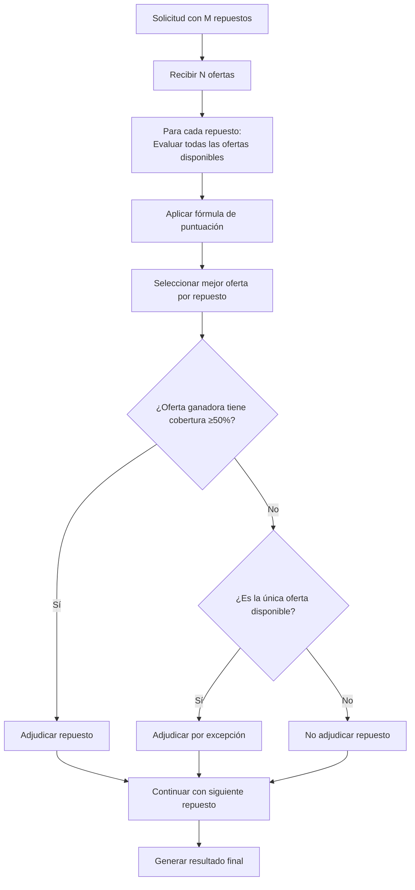
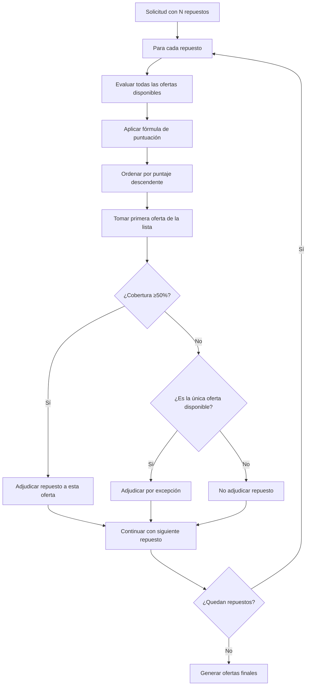
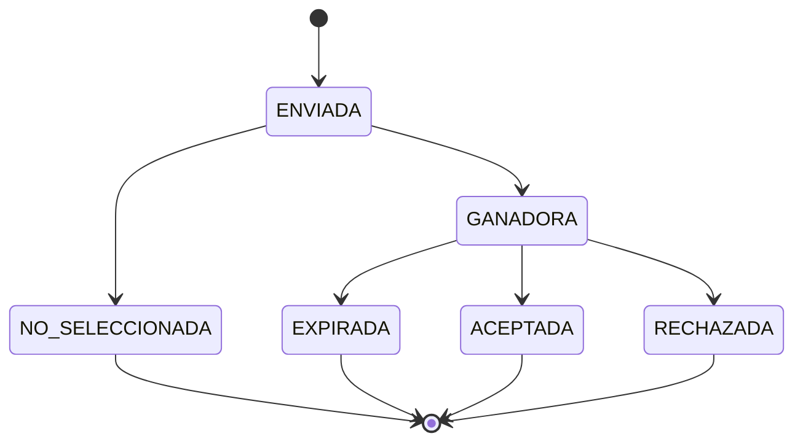

# Especificación: Simplificación del Sistema de Evaluación de Ofertas TeLOO V3

## 1. Resumen Ejecutivo

### 1.1 Objetivo

Simplificar el sistema de evaluación de ofertas eliminando los estados complejos `GANADORA_PARCIAL` y `GANADORA_TOTAL`, implementando un modelo de adjudicación por repuesto individual que permite ofertas mixtas de múltiples asesores.

### 1.2 Beneficios Esperados

* **Simplicidad**: Reducción de complejidad en estados de oferta

* **Flexibilidad**: Adjudicación mixta optimiza cobertura y calidad

* **Transparencia**: Evaluación clara por repuesto individual

* **Eficiencia**: Mejor aprovechamiento de ofertas disponibles

* **Escalabilidad**: Funciona desde 1 hasta N ofertas sin límites

## 2. Escalabilidad del Modelo: 1 a N Ofertas

### 2.1 Característica Clave: Escalabilidad Ilimitada

**El modelo de evaluación es completamente escalable y funciona eficientemente con cualquier número de ofertas:**

* ✅ **1 oferta**: Evaluación directa y adjudicación automática

* ✅ **2-3 ofertas**: Competencia básica con regla del 50%

* ✅ **4-10 ofertas**: Competencia media con optimización

* ✅ **10+ ofertas**: Competencia completa con máxima optimización

* ✅ **N ofertas**: Sin límites técnicos, performance escalable

### 2.2 Algoritmo Unificado



### **2.2.1 Algoritmo Único para Cualquier Número de Ofertas:**

#### **N=1 (Oferta Única)**

* **Algoritmo**: Mismo proceso de evaluación

* **Regla del 50%**: No aplica (es la única opción disponible)

* **Resultado**: Adjudicación automática si tiene disponibilidad para el repuesto

#### **N≥2 (Múltiples Ofertas)**

* **Algoritmo**: Exactamente el mismo proceso que con N=1

* **Regla del 50%**: Se aplica igual independientemente del número

* **Resultado**: Competencia normal, mejores ofertas ganan por repuesto

**Nota Importante**: El algoritmo es idéntico para cualquier número de ofertas. Solo cambia la cantidad de opciones disponibles para competir por cada repuesto.

### 2.3 Ejemplos Prácticos con Diferentes Números de Ofertas

**Importante**: El proceso de evaluación es idéntico en todos los casos. Solo cambia la cantidad de opciones disponibles para competir.

#### Caso 1: Una Sola Oferta (N=1)

```
Lógica Simplificada:
- Si la oferta tiene el repuesto → GANADORA
- Si no tiene el repuesto → Repuesto sin cubrir
- No aplica regla del 50% (es la única opción)

Ejemplo:
Solicitud: 10 repuestos
Oferta Única: Cubre 6/10 repuestos
Resultado: GANADORA (adjudicada 6 repuestos, 4 sin cubrir)
```

#### Caso 2: Dos Ofertas (N=2)

```
Solicitud: 8 repuestos
Ofertas recibidas: 2

Proceso de evaluación (idéntico al de N=100):
1. Para cada repuesto, evaluar ambas ofertas
2. Aplicar fórmula de puntuación
3. Seleccionar la mejor por repuesto
4. Aplicar regla del 50%

Resultado ejemplo:
- Oferta A: 6/8 repuestos (75%) → GANADORA
- Oferta B: 4/8 repuestos (50%) → GANADORA

Adjudicación mixta entre ambas ofertas
```

#### Caso 3: Cinco Ofertas (N=5)

```
Solicitud: 12 repuestos
Ofertas recibidas: 5

Proceso de evaluación (idéntico al de N=2):
1. Para cada repuesto, evaluar las 5 ofertas
2. Aplicar fórmula de puntuación
3. Seleccionar la mejor por repuesto
4. Aplicar regla del 50%

Resultado ejemplo:
- Oferta 1: 7/12 repuestos (58%) → GANADORA
- Oferta 2: 6/12 repuestos (50%) → GANADORA
- Oferta 3: 4/12 repuestos (33%) → NO_SELECCIONADA
- Oferta 4: 3/12 repuestos (25%) → NO_SELECCIONADA
- Oferta 5: 2/12 repuestos (17%) → NO_SELECCIONADA

Adjudicación mixta entre Oferta 1 y Oferta 2
```

#### Caso 3: Múltiples Ofertas (N=4-10)

```
Lógica de Competencia Media:
- Competencia real entre ofertas
- Optimización por calidad/precio
- Múltiples ganadoras posibles

Ejemplo:
Solicitud: 20 repuestos
5 ofertas compitiendo
Resultado: 2-3 ofertas ganadoras con especialización
```

#### Caso 4: Doce Ofertas (N=12)

```
Solicitud: 25 repuestos
Ofertas recibidas: 12

Proceso de evaluación (idéntico al de N=2 y N=5):
1. Para cada repuesto, evaluar las 12 ofertas
2. Aplicar fórmula de puntuación
3. Seleccionar la mejor por repuesto
4. Aplicar regla del 50%

Resultado ejemplo:
- Oferta A: 15/25 repuestos (60%) → GANADORA
- Oferta B: 14/25 repuestos (56%) → GANADORA  
- Oferta C: 13/25 repuestos (52%) → GANADORA
- Oferta D: 12/25 repuestos (48%) → NO_SELECCIONADA
- Ofertas E-L: <48% → NO_SELECCIONADAS

Adjudicación mixta entre Ofertas A, B y C

Nota: Más ofertas = más competencia = mejor optimización, 
pero el algoritmo es exactamente el mismo
```

### 2.4 Ejemplos Específicos Detallados

#### Ejemplo A: Escenario con 1 Oferta

```
Solicitud ID: SOL-001
Repuestos solicitados: 8
Ofertas recibidas: 1

Oferta Única (Asesor-123):
- Repuesto A: ✅ $100, 2 días, 6 meses
- Repuesto B: ✅ $50, 1 día, 12 meses  
- Repuesto C: ❌ No disponible
- Repuesto D: ✅ $200, 3 días, 6 meses
- Repuesto E: ❌ No disponible
- Repuesto F: ✅ $75, 1 día, 12 meses
- Repuesto G: ✅ $150, 2 días, 6 meses
- Repuesto H: ✅ $80, 1 día, 12 meses

Resultado:
- Oferta Única: GANADORA (6/8 repuestos adjudicados)
- Repuestos C y E: Sin cubrir
- Cobertura: 75% (no aplica regla 50% por ser única)
```

#### Ejemplo B: Escenario con 5 Ofertas

```
Solicitud ID: SOL-002
Repuestos solicitados: 12
Ofertas recibidas: 5

Evaluación por repuesto:
Repuesto A: Oferta-1 (4.8), Oferta-2 (4.2), Oferta-3 (3.9) → Gana Oferta-1
Repuesto B: Oferta-2 (4.7), Oferta-4 (4.1) → Gana Oferta-2
Repuesto C: Oferta-3 (4.5), Oferta-1 (4.0), Oferta-5 (3.8) → Gana Oferta-3
...

Coberturas finales:
- Oferta-1: 5/12 repuestos (42%) → NO_SELECCIONADA
- Oferta-2: 7/12 repuestos (58%) → GANADORA
- Oferta-3: 6/12 repuestos (50%) → GANADORA
- Oferta-4: 2/12 repuestos (17%) → NO_SELECCIONADA
- Oferta-5: 1/12 repuestos (8%) → NO_SELECCIONADA

Resultado: Adjudicación mixta entre Oferta-2 y Oferta-3
```

#### Ejemplo C: Escenario con 12 Ofertas

```
Solicitud ID: SOL-003
Repuestos solicitados: 25
Ofertas recibidas: 12

Competencia completa con especialización:
- Ofertas especializadas en diferentes categorías
- Máxima optimización calidad/precio
- 4 ofertas ganadoras con fortalezas específicas

Resultado optimizado:
- Oferta-A: Especialista en frenos (8 repuestos)
- Oferta-B: Especialista en motor (7 repuestos)  
- Oferta-C: Especialista en suspensión (6 repuestos)
- Oferta-D: Especialista en eléctricos (3 repuestos)
- 8 ofertas: NO_SELECCIONADAS
- 1 repuesto: Sin cubrir
```

## 2. Análisis Comparativo: Sistema Actual vs Propuesto

### 2.1 Sistema Actual (Complejo)

#### Estados de Oferta Actuales:

```
ENVIADA → GANADORA_PARCIAL → ACEPTADA/RECHAZADA
       → GANADORA_TOTAL   → ACEPTADA/RECHAZADA
       → NO_SELECCIONADA
       → EXPIRADA
```

#### Problemas Identificados:

* **Complejidad innecesaria**: Distinción entre parcial/total no aporta valor

* **Rigidez**: Una oferta debe ganar todo o nada por categorías

* **Ineficiencia**: Desperdicio de ofertas buenas para repuestos específicos

* **Confusión**: Estados difíciles de entender para asesores y clientes

### 2.2 Sistema Propuesto (Simplificado)

#### Estados de Oferta Simplificados:

```
ENVIADA → GANADORA → ACEPTADA/RECHAZADA
       → NO_SELECCIONADA
       → EXPIRADA
```

#### Ventajas del Nuevo Sistema:

* **Evaluación granular**: Por repuesto individual

* **Adjudicación mixta**: Múltiples asesores pueden ganar

* **Optimización**: Mejor cobertura y calidad general

* **Simplicidad**: Solo un estado ganador

## 3. Nueva Lógica de Evaluación

### 3.1 Algoritmo de Evaluación por Repuesto



### 3.2 Fórmula de Evaluación (Mantiene la Existente)

```
Puntaje_Final = (Puntaje_Precio × peso_precio) + 
                (Puntaje_Tiempo × peso_tiempo) + 
                (Puntaje_Garantía × peso_garantía)
```

### 3.3 Reglas de Adjudicación

#### Algoritmo de Decisión por Repuesto:

```
Para cada repuesto R:
  1. Obtener ofertas que incluyen R
  2. Ordenar por puntaje descendente
  3. Para cada oferta O en orden:
     a) Si cobertura(O) ≥ 50%: ADJUDICAR a O y SALIR
     b) Si cobertura(O) < 50%:
        - Si O es única disponible: ADJUDICAR a O y SALIR
        - Si hay otras ofertas: CONTINUAR con siguiente
  4. Si ninguna cumple: NO ADJUDICAR
```

#### Casos de Adjudicación:

1. **Adjudicación Normal**: Mejor puntaje + cobertura ≥50%
2. **Adjudicación por Cascada**: Segundo/tercer mejor puntaje que cumple 50%
3. **Adjudicación por Excepción**: Única oferta disponible (sin importar cobertura)
4. **Sin Adjudicación**: Ninguna oferta cumple criterios

#### Regla Principal: Cobertura Mínima del 50%

* Una oferta debe cubrir al menos el 50% de los repuestos solicitados

* Si no cumple, no se le adjudica ningún repuesto

* **Regla de Cascada por Puntaje**: Si la oferta con mejor puntaje tiene cobertura <50% pero NO es la única disponible, se evalúa la siguiente mejor hasta encontrar una que cumpla la regla del 50%

* **Excepción**: Si es la única oferta disponible para un repuesto específico

#### Detalle de la Regla de Cascada por Puntaje

**Pseudocódigo:**

```
Para cada repuesto:
  1. Ordenar ofertas por puntaje descendente
  2. Para cada oferta en orden:
     - Si cobertura ≥50%: ADJUDICAR y salir
     - Si cobertura <50% y es única disponible: ADJUDICAR y salir
     - Si cobertura <50% y hay otras: continuar con siguiente
  3. Si ninguna cumple: NO ADJUDICAR
```

**Ejemplo práctico:**

* **Repuesto X**:

  * Oferta A: Puntaje 95, Cobertura 30%

  * Oferta B: Puntaje 88, Cobertura 60%

  * Oferta C: Puntaje 82, Cobertura 45%

* **Resultado**: Se adjudica a Oferta B (segundo mejor puntaje) porque cumple la regla del 50%, mientras que Oferta A (mejor puntaje) no la cumple y no es única.

#### Ejemplo Práctico con Regla de Cascada:

```
Solicitud: 15 repuestos

Evaluación por repuesto:
- Repuesto A: Oferta 1 (95 pts, 87% cob) → GANADORA (cumple 50%)
- Repuesto B: Oferta 3 (92 pts, 27% cob), Oferta 2 (88 pts, 60% cob) → Oferta 2 GANADORA (cascada)
- Repuesto C: Oferta 2 (90 pts, 60% cob) → GANADORA (cumple 50%)
- Repuesto D: Solo Oferta 3 (85 pts, 27% cob) → GANADORA (excepción única)
- ...

Resultado final:
- Oferta 1: 8/15 repuestos → GANADORA
- Oferta 2: 6/15 repuestos → GANADORA  
- Oferta 3: 1/15 repuestos → GANADORA (por excepción)

Adjudicación mixta entre 3 asesores
```

### 3.4 Casos Especiales

#### Caso 1: Único Proveedor

```
Repuesto K: Solo Oferta 3 lo tiene
→ Se adjudica a Oferta 3 por excepción (aunque tenga <50% cobertura total)
```

#### Caso 2: Sin Ofertas Disponibles

```
Repuesto O: Ninguna oferta lo tiene
→ Queda sin adjudicar en la solicitud final
```

## 4. Estados de Oferta Definitivos

### 4.1 Estados Simplificados

| Estado            | Descripción                          | Visible Para    | Acciones Disponibles          |
| ----------------- | ------------------------------------ | --------------- | ----------------------------- |
| `ENVIADA`         | Oferta enviada, esperando evaluación | Asesor          | Modificar (si está en tiempo) |
| `GANADORA`        | Gana al menos un repuesto            | Asesor, Cliente | Aceptar/Rechazar (Cliente)    |
| `NO_SELECCIONADA` | No gana ningún repuesto              | Asesor          | Ver detalles                  |
| `EXPIRADA`        | Cliente no responde en 20h           | Asesor, Cliente | Solo consulta                 |
| `RECHAZADA`       | Cliente rechaza oferta               | Asesor, Cliente | Solo consulta                 |
| `ACEPTADA`        | Cliente acepta oferta                | Asesor, Cliente | Procesar pedido               |

### 4.2 Transiciones de Estado



**Descripción de las transiciones:**

* **ENVIADA → GANADORA**: La oferta gana al menos un repuesto en la evaluación automática

* **ENVIADA → NO\_SELECCIONADA**: La oferta no gana ningún repuesto en la evaluación automática

* **GANADORA → ACEPTADA**: El cliente acepta la oferta dentro del tiempo límite (configurable por administrador)

* **GANADORA → RECHAZADA**: El cliente rechaza la oferta explícitamente

* **GANADORA → EXPIRADA**: Sin respuesta del cliente después del tiempo límite (configurable por administrador)

**Estados finales:**

* **ACEPTADA**: Procesar pedido

* **RECHAZADA**: Oferta rechazada

* **EXPIRADA**: Oferta vencida

* **NO\_SELECCIONADA**: Sin acción requerida

## 5. Parámetros Configurables del Sistema

### 5.1 Timeouts y Tiempos de Respuesta

| Parámetro                     | Valor por Defecto | Descripción                                                      | Configurable por |
| ----------------------------- | ----------------- | ---------------------------------------------------------------- | ---------------- |
| **Timeout Respuesta Cliente** | 20 horas          | Tiempo límite para que el cliente responda a una oferta ganadora | Administrador    |
| **Timeout Evaluación**        | 5 minutos         | Tiempo máximo para completar la evaluación automática            | Administrador    |
| **Timeout Warning**           | 2 horas antes     | Cuándo enviar notificación de advertencia de expiración          | Administrador    |

### 5.2 Criterios de Evaluación

| Parámetro            | Valor por Defecto | Descripción                                             | Configurable por |
| -------------------- | ----------------- | ------------------------------------------------------- | ---------------- |
| **Peso Precio**      | 50%               | Importancia del precio en la evaluación                 | Administrador    |
| **Peso Tiempo**      | 35%               | Importancia del tiempo de entrega en la evaluación      | Administrador    |
| **Peso Garantía**    | 15%               | Importancia de la garantía en la evaluación             | Administrador    |
| **Cobertura Mínima** | 50%               | Porcentaje mínimo de cobertura requerido para adjudicar | Administrador    |

### 5.3 Notificaciones

| Parámetro                  | Valor por Defecto | Descripción                                         | Configurable por |
| -------------------------- | ----------------- | --------------------------------------------------- | ---------------- |
| **Notificación Inmediata** | Habilitada        | Envío inmediato de notificaciones de estado         | Administrador    |
| **Recordatorios**          | Cada 6 horas      | Frecuencia de recordatorios para ofertas pendientes | Administrador    |

**Nota importante**: Todos estos parámetros pueden ser modificados por el administrador del sistema a través del panel de configuración, permitiendo adaptar el comportamiento del sistema a las necesidades específicas del negocio.

## 6. Impacto en el Sistema

### 6.1 Cambios en Base de Datos

#### Tabla `ofertas` - Modificaciones:

```sql
-- Eliminar estados obsoletos
ALTER TABLE ofertas DROP CONSTRAINT IF EXISTS chk_estado_oferta;

-- Nuevo constraint con estados simplificados
ALTER TABLE ofertas ADD CONSTRAINT chk_estado_oferta 
CHECK (estado IN ('ENVIADA', 'GANADORA', 'NO_SELECCIONADA', 'EXPIRADA', 'RECHAZADA', 'ACEPTADA'));

-- Nueva tabla para adjudicaciones por repuesto
CREATE TABLE adjudicaciones_repuesto (
    id UUID PRIMARY KEY DEFAULT gen_random_uuid(),
    solicitud_id UUID NOT NULL REFERENCES solicitudes(id),
    oferta_id UUID NOT NULL REFERENCES ofertas(id),
    repuesto_id UUID NOT NULL REFERENCES repuestos(id),
    puntaje_obtenido DECIMAL(3,2) NOT NULL,
    precio_adjudicado DECIMAL(10,2) NOT NULL,
    tiempo_entrega_adjudicado INTEGER NOT NULL,
    garantia_adjudicada INTEGER NOT NULL,
    created_at TIMESTAMP WITH TIME ZONE DEFAULT NOW(),
    UNIQUE(solicitud_id, repuesto_id)
);
```

### 6.2 Modificaciones en Lógica de Evaluación

#### Archivo: `evaluacionService.ts`

```typescript
interface AdjudicacionRepuesto {
  repuestoId: string;
  ofertaId: string;
  puntajeObtenido: number;
  precio: number;
  tiempoEntrega: number;
  garantia: number;
}

interface ResultadoEvaluacion {
  adjudicaciones: AdjudicacionRepuesto[];
  ofertasGanadoras: string[];
  ofertasNoSeleccionadas: string[];
  repuestosSinCubrir: string[];
}

async function evaluarOfertasPorRepuesto(solicitudId: string): Promise<ResultadoEvaluacion> {
  // 1. Obtener todos los repuestos de la solicitud
  // 2. Para cada repuesto, evaluar todas las ofertas disponibles
  // 3. Aplicar regla de cobertura mínima 50%
  // 4. Generar adjudicaciones por repuesto
  // 5. Actualizar estados de ofertas
}
```

### 6.3 Actualizaciones en Interfaz de Usuario

#### Componente: `OfertasTable.tsx`

* **Eliminar**: Columnas de estado parcial/total

* **Agregar**: Columna de "Repuestos Adjudicados"

* **Modificar**: Indicadores visuales para ofertas mixtas

#### Vista de Asesor:

```
┌─────────────────────────────────────────────────┐
│ Mi Oferta: GANADORA                             │
│ Repuestos adjudicados: 8 de 15                  │
│ ├─ Repuesto A: $400 (Ganador)                   │
│ ├─ Repuesto B: $100 (Ganador)                   │
│ ├─ Repuesto F: $40 (Perdedor - Oferta 2)        │
│ └─ ...                                          │
└─────────────────────────────────────────────────┘
```

#### Vista de Cliente:

```
┌─────────────────────────────────────────────────┐
│ Su Solicitud: Oferta Mixta Disponible           │
│ Proveedores: 2 asesores                         │
│ Cobertura: 14 de 15 repuestos                   │
│                                                 │
│ [Aceptar Oferta] [Rechazar] [Ver Detalles]      │
└─────────────────────────────────────────────────┘
```

### 6.4 Comunicación con Asesores y Clientes

#### Notificaciones para Asesores:

* **GANADORA**: "¡Felicitaciones! Tu oferta ganó X repuestos"

* **NO\_SELECCIONADA**: "Tu oferta no fue seleccionada en esta ocasión"

#### Notificaciones para Clientes:

* **Oferta Disponible**: "Oferta mixta disponible de X proveedores"

* **Timeout Warning**: "Tu oferta expira en X horas" (tiempo configurable por administrador)

## 7. Plan de Implementación

### 7.1 Fase 1: Preparación (Semana 1)

* [ ] Backup completo de base de datos

* [ ] Crear rama `feature/simplificacion-evaluacion`

* [ ] Actualizar documentación técnica

* [ ] Preparar scripts de migración

### 7.2 Fase 2: Backend (Semana 2)

* [ ] Modificar esquema de base de datos

* [ ] Implementar nueva lógica de evaluación

* [ ] Actualizar APIs de evaluación

* [ ] Crear tests unitarios para nuevo algoritmo

### 7.3 Fase 3: Frontend (Semana 3)

* [ ] Actualizar componentes de ofertas

* [ ] Modificar dashboards de asesor y cliente

* [ ] Implementar nuevas notificaciones

* [ ] Actualizar tests de interfaz

### 7.4 Fase 4: Testing (Semana 4)

* [ ] Tests de integración completos

* [ ] Pruebas con datos reales (ambiente staging)

* [ ] Validación con usuarios beta

* [ ] Ajustes finales

### 7.5 Fase 5: Despliegue (Semana 5)

* [ ] Despliegue en producción

* [ ] Monitoreo intensivo 48h

* [ ] Comunicación a usuarios

* [ ] Soporte post-despliegue

### 7.6 Plan de Rollback

```sql
-- Script de rollback si es necesario
-- 1. Restaurar estados anteriores
-- 2. Migrar datos de adjudicaciones_repuesto
-- 3. Revertir cambios en aplicación
-- 4. Comunicar a usuarios
```

## 8. Métricas de Éxito

### 8.1 Métricas Técnicas

* **Reducción de complejidad**: -40% líneas de código en evaluación

* **Performance**: Tiempo de evaluación <2 segundos

* **Cobertura**: >95% repuestos cubiertos en ofertas mixtas

### 8.2 Métricas de Negocio

* **Satisfacción de asesores**: >85% aprobación del nuevo sistema

* **Satisfacción de clientes**: >90% comprensión de ofertas mixtas

* **Eficiencia**: +25% aprovechamiento de ofertas disponibles

## 9. Riesgos y Mitigaciones

### 9.1 Riesgos Identificados

| Riesgo                        | Probabilidad | Impacto | Mitigación                   |
| ----------------------------- | ------------ | ------- | ---------------------------- |
| Confusión inicial de usuarios | Media        | Medio   | Capacitación y documentación |
| Bugs en nueva lógica          | Baja         | Alto    | Testing exhaustivo           |
| Performance degradada         | Baja         | Medio   | Optimización de consultas    |

### 9.2 Plan de Contingencia

* **Rollback automático** si errores críticos >5%

* **Soporte 24/7** durante primera semana

* **Hotfixes** preparados para issues comunes

## 10. Conclusión

La simplificación del sistema de evaluación de ofertas representa una mejora significativa en términos de:

1. **Simplicidad operacional**: Menos estados, lógica más clara
2. **Optimización de recursos**: Mejor aprovechamiento de ofertas
3. **Experiencia de usuario**: Interfaces más intuitivas
4. **Mantenibilidad**: Código más limpio y testeable

El nuevo modelo de adjudicación por repuesto individual con ofertas mixtas maximiza la cobertura y calidad mientras simplifica la comprensión del sistema para todos los actores involucrados.

***

**Documento preparado por**: SOLO Document\
**Fecha**: $(date)\
**Versión**: 1.0\
**Estado**: Listo para revisión e implementación
