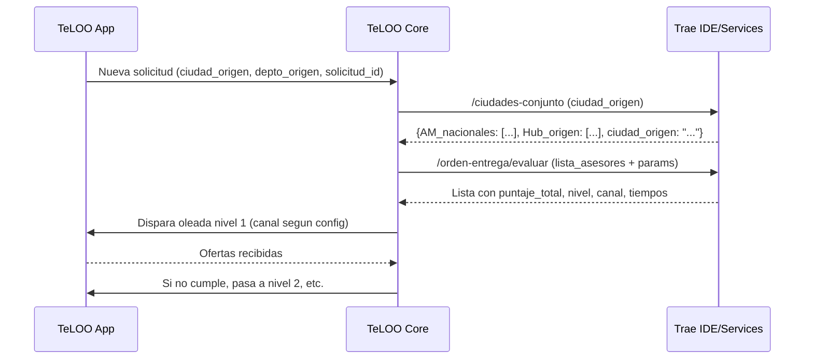

# Sistema_Orden_Entrega_Asesores_TeLOO — v3 (fusión completa v2 + v3)
**Fecha:** 2025-11-04  
**Autor:** TeLOO Core  
**Ámbito:** Priorización y entrega de solicitudes a asesores (orden de entrega en 5 niveles).  
**Objetivo:** Esta versión **v3 (fusión)** toma como base la **v3** y le **agrega íntegramente** todo lo que estaba en la **v2** y faltaba, **sin resumir**. Se preserva la estructura y detalle de v3 (nuevas variables y pseudocódigos) y se reincorporan los bloques de v2 (objetivo extendido, pseudocódigo ampliado de proximidad con `HUB_asesor`, tabla completa de parámetros, manejo de errores & borde, tablas 12.x, consideraciones de rendimiento y checklist), reorganizando únicamente para **coherencia**.

---

## 1. Descripción general
El módulo determina **a qué asesores y en qué orden** se les envía una solicitud de repuestos.  
Para cada solicitud se:
1) Determina el **conjunto de asesores elegibles** (según filtros: ciudad base, **todas las áreas metropolitanas nacionales**, y el **hub logístico** de la ciudad base).  
2) Calcula **puntajes** por asesor usando variables objetivas y **pesos configurables**.  
3) Clasifica a los asesores en **5 niveles de entrega**; cada nivel usa **canal** (WhatsApp / Push) y **ventana de espera** configurables.  
4) Ejecuta **oleadas** por nivel hasta obtener el número deseado de ofertas o agotar niveles.

**Compatibilidad geográfica:** Las reglas no **requieren** coordenadas, pero son **compatibles** si existieran en el futuro (por ejemplo, para validar pertenencia a un HUB mediante radio).

---

## 2. Fórmula de puntaje (configurable)
**Definición**  
\[
\textbf{puntaje_total} = (\textbf{proximidad} \times W1) + (\textbf{actividad_reciente\_5} \times W2) + (\textbf{desempeño_histórico\_5} \times W3) + (\textbf{nivel_confianza} \times W4)
\]

- **Rango de cada variable:** 1.0 a 5.0  
- **Pesos (configurables, suma=1.0):**  
  - `W1 = peso_proximidad = 0.40`  
  - `W2 = peso_actividad  = 0.25`  
  - `W3 = peso_desempeño  = 0.20`  
  - `W4 = peso_confianza  = 0.15`

**Normalización previa (obligatoria):**
- `actividad_reciente_pct (0–100)` → `actividad_reciente_5 = 1 + 4 × (actividad_reciente_pct / 100)`  
- `desempeño_histórico_pct (0–100)` → `desempeño_histórico_5 = 1 + 4 × (desempeño_histórico_pct / 100)`  
- `nivel_confianza`: puntaje directo 1–5 (asignado por auditoría).  
- `proximidad`: 1–5 según **Sección 4** (método formal).

**Tratamiento de faltantes (fallback):**
- Si `actividad_reciente_pct` o `desempeño_histórico_pct` son nulos → usar **0** antes de escalar (→ 1.0).  
- Si `nivel_confianza` nulo → usar **3.0**.  
- Si `proximidad` no calculable → usar **3.0**.

---

## 3. Niveles de orden de entrega (rangos + canal + tiempos) — todo configurable
Los niveles se asignan **por puntaje_total** usando **umbrales configurables**. También son configurables **canal** y **ventana de espera**.

| Nivel | Rango de puntaje (config.) | Canal (config.) | Tiempo de espera (min, config.) | Objetivo |
|---|---|---|---|---|
| **1** | `nivel1_min` ≤ p ≤ 5.0 (default: **≥ 4.5**) | `canal_nivel1` (default: **WhatsApp**) | `nivel1_tiempo` (default: **15**) | Prioridad máxima |
| **2** | `nivel2_min` ≤ p < `nivel1_min` (default: **4.0–4.49**) | `canal_nivel2` (default: **WhatsApp**) | `nivel2_tiempo` (default: **20**) | Alta prioridad |
| **3** | `nivel3_min` ≤ p < `nivel2_min` (default: **3.5–3.99**) | `canal_nivel3` (default: **Push**) | `nivel3_tiempo` (default: **25**) | Media |
| **4** | `nivel4_min` ≤ p < `nivel3_min` (default: **3.0–3.49**) | `canal_nivel4` (default: **Push**) | `nivel4_tiempo` (default: **30**) | Respaldo |
| **5** | p < `nivel4_min` (default: **< 3.0**) | `canal_nivel5` (default: **N/A**) | `nivel5_tiempo` (default: **0**) | Reserva (sin envío) |

**Extras:**  
- `ofertas_minimas_deseadas` (default: **2**) → cierre anticipado si se alcanza.  
- `tamano_oleada_max` (default: **0** = ilimitado).

---

## 4. Cálculo de PROXIMIDAD (fusión: secciones v2 + v3)
**Propósito:** Cercanía lógica del asesor respecto a la **ciudad origen** de la solicitud, con jerarquía **ciudad → área metropolitana (AM) → hub logístico (HUB) → otras áreas**.

**Fuentes de datos:**
- `Areas_Metropolitanas_TeLOO` (8 oficiales + 3 funcionales acordadas):  
  - Campos: `area_metropolitana`, `ciudad_nucleo`, `municipio_norm` (una fila por municipio).  
- `Asignacion_Hubs_200km` (o `Asignacion_12_Hubs_200km`):  
  - Campos: `municipio_norm`, `hub_asignado_norm`.  
- `TeLOO_Maestra_Municipios_Zonas_Logisticas_vFinal`: catálogo base (dep/mun).

**Valores de proximidad (configurables):**
- `prox_misma_ciudad` = **5.0**  
- `prox_AM_mismo_hub` = **4.0**  
- `prox_mismo_hub` = **3.5**  
- `prox_OTRA_AM_fuera_hub` = **3.0**

### 4.1 Algoritmo (pseudocódigo extendido — restaurado de v2 e integrado en v3)
```pseudo
INPUT: ciudad_origen, depto_origen, asesor.ciudad, asesor.depto

# Normalización robusta: upper, sin tildes, trim, espacios compactados
c0 = NORMALIZA(ciudad_origen); d0 = NORMALIZA(depto_origen)
cA = NORMALIZA(asesor.ciudad);  dA = NORMALIZA(asesor.depto)

# Conjuntos de pertenencia
AM_ciudad_origen  = MUNICIPIOS_DE_LA_MISMA_AM(c0)   # set o vacío
HUB_ciudad_origen = MUNICIPIOS_DEL_MISMO_HUB(c0)    # set
AM_asesor         = MUNICIPIOS_DE_LA_MISMA_AM(cA)   # set o vacío
HUB_asesor        = MUNICIPIOS_DEL_MISMO_HUB(cA)    # set

# Reglas (ordenadas, la primera que cumpla aplica)
IF cA == c0:
    proximidad = prox_misma_ciudad
ELSE IF (cA ∈ AM_ciudad_origen) AND (cA ∈ HUB_ciudad_origen):
    # misma AM y comparten HUB
    proximidad = prox_AM_mismo_hub
ELSE IF (cA ∈ HUB_ciudad_origen):
    proximidad = prox_mismo_hub
ELSE IF (AM_asesor ≠ ∅) AND (cA ∉ AM_ciudad_origen):
    proximidad = prox_OTRA_AM_fuera_hub
ELSE:
    # fuera de AM y HUB del origen → penaliza
    proximidad = prox_OTRA_AM_fuera_hub

RETURN proximidad  # ∈ (5.0, 4.0, 3.5, 3.0)
```

**Notas de implementación (v2 + v3):**
- `MUNICIPIOS_DE_LA_MISMA_AM(x)` → AM a la que pertenece `x` y todos sus municipios.  
- `MUNICIPIOS_DEL_MISMO_HUB(x)` → todos los municipios asignados al **mismo HUB** de `x`.  
- Comparaciones con **normalización estricta**.  
- **Deduplicación** con estructuras `set`.  
- **Caching** de AM/HUB por ciudad (TTL sugerido: **15 min**).  
- Si una ciudad no está en AM ni HUB → asignar `prox_OTRA_AM_fuera_hub` y **log de advertencia**.

---

## 5. Variables adicionales — detalle técnico (nuevo en v3, mantenido íntegro)
### 5.1 Actividad reciente (`actividad_reciente_5`)
**Objetivo:** medir la participación operativa reciente del asesor (propensión a responder).

**Fuente de datos:** `Historial_Respuestas_Ofertas`  
Campos: `asesor_id`, `solicitud_id`, `fecha_envio`, `respondio (bool)`

**Parámetros configurables:**
- `periodo_dias_actividad` (default 30)  
- `actividad_min_solicitudes_para_medicion` (default 1)  
- `actividad_pondera_no_vistas` (bool, default false; si true, descuenta mensajes no abiertos)

**Cálculo:**  
\[
actividad\_reciente\_% =
\begin{cases}
0 & enviadas = 0 \\
\frac{respuestas}{enviadas} × 100 & enviadas > 0
\end{cases}
\]
\[
actividad\_reciente\_5 = 1 + 4 × (actividad\_reciente\_% / 100)
\]

**Pseudocódigo:**
```pseudo
INPUT: asesor_id
from = HOY - periodo_dias_actividad

enviadas  = COUNT(Envios WHERE asesor_id AND fecha_envio >= from)
respondio = COUNT(Respuestas WHERE asesor_id AND fecha_envio >= from AND respondio=true)

IF enviadas < actividad_min_solicitudes_para_medicion:
    act_pct = 0
ELSE:
    act_pct = (respondio / enviadas) * 100

actividad_5 = 1 + 4*(act_pct/100)
RETURN actividad_5
```

**Validaciones:** `act_pct` ∈ [0,100] (clamp). Persistir `actividad_5` para auditoría por `solicitud_id` y `asesor_id`.

---

### 5.2 Desempeño histórico (`desempeño_histórico_5`)
**Objetivo:** medir la calidad operativa histórica (ganar, cumplir y responder con eficiencia).

**Fuente de datos:** `Ofertas_Historicas`  
Campos: `asesor_id`, `fecha`, `adjudicada (bool)`, `entrega_exitosa (bool)`, `tiempo_respuesta_seg`

**Parámetros configurables:**
- `periodo_meses_desempeno` (default 6)  
- `tiempo_max_esperado_respuesta_seg` (default 1800)  
- `peso_desemp_adjudicacion` (0.50)  
- `peso_desemp_cumplimiento` (0.30)  
- `peso_desemp_respuesta` (0.20)

**Submétricas:**  
- `tasa_adjudicación = (adjudicadas / enviadas) × 100`  
- `tasa_cumplimiento = (cumplidas / adjudicadas) × 100`  
- `eficiencia_respuesta = max(0, 1 - (t_promedio / tiempo_max)) × 100`

**Fórmula y escala:**  
\[
desempeño\_% = P1·tasa\_adjudicación + P2·tasa\_cumplimiento + P3·eficiencia\_respuesta,\quad
desempeño\_5 = 1 + 4 × \frac{desempeño\_%}{100}
\]

**Pseudocódigo:** *(igual al de v3, con clamps y persistencia para auditoría.)*

---

### 5.3 Nivel de confianza (`nivel_confianza`)
**Objetivo:** indicador reputacional/administrativo; evita fraudes e incumplimientos.

**Fuente de datos:** `Auditoria_Tiendas` (o servicio externo)  
Campos: `tienda_id`, `ultima_revision`, `estado`, `puntaje_confianza (1–5)`

**Parámetros configurables:**
- `periodicidad_confianza_dias` (30)  
- `confianza_valor_faltante` (3.0)  
- `confianza_minima_operar` (2.0; puede restringir envío)

**Escala orientativa (ajustable):** 5 Excelente · 4 Buena · 3 Media · 2 Baja · 1 Crítica.  
**Pseudocódigo:** *(igual al de v3.)*

---

## 6. Integración y orden de clasificación
1) Calcular `puntaje_total` con las cuatro variables escaladas (1–5) y pesos `W1..W4`.  
2) Clasificar en **niveles 1–5** (umbrales configurables).  
3) Asignar **canal** y **tiempo** por nivel.  
4) Orden en empates: ver **Sección 8**.

---

## 7. Flujo del proceso (Mermaid)
```mermaid
flowchart TD
A[Solicitud entrante (ciudad_origen, depto_origen)] --> B[Construir conjunto elegible de asesores]
B --> C[Calcular variables por asesor]
C --> C1[Proximidad (Sección 4)]
C --> C2[Actividad (Sección 5.1)]
C --> C3[Desempeño (Sección 5.2)]
C --> C4[Nivel de confianza (Sección 5.3)]
C --> D[Calcular puntaje_total con W1..W4]
D --> E[Clasificar Nivel 1..5 (umbrales config.)]
E --> F{¿Nivel=1 o 2?}
F -- Sí --> G[Notificar por WhatsApp]
F -- No --> H[Notificar por Push]
G --> I[Esperar tiempo nivel (config.)]
H --> I[Esperar tiempo nivel (config.)]
I --> J{¿Ofertas_mínimas alcanzadas?}
J -- Sí --> K[Cerrar ronda y evaluar ofertas]
J -- No --> L[Siguiente nivel / oleada]
L -->|Agotar| M[Fin sin ofertas]
```

---

## 8. Reglas de tie-break (empates) — configurables
1) **Mayor `nivel_confianza`** (`prioridad_confianza=true`)  
2) **Mayor `actividad_reciente_5`** (`prioridad_actividad=true`)  
3) **Menor `tiempo_respuesta` reciente** (si disponible)  
4) **Aleatorio estable** (seed por `solicitud_id`).

---

## 9. Parámetros del sistema (tabla de configuración) — **restaurado íntegro de v2**
> Todos estos parámetros son **editables por el administrador** sin despliegue.

| Categoría | Clave parámetro | Tipo | Valor inicial | Descripción |
|---|---|---|---|---|
| Pesos | `peso_proximidad` | float | 0.40 | W1 |
|  | `peso_actividad` | float | 0.25 | W2 |
|  | `peso_desempeño` | float | 0.20 | W3 |
|  | `peso_confianza` | float | 0.15 | W4 |
| Proximidad | `prox_misma_ciudad` | float | 5.0 | Puntaje |
|  | `prox_AM_mismo_hub` | float | 4.0 | Puntaje |
|  | `prox_mismo_hub` | float | 3.5 | Puntaje |
|  | `prox_OTRA_AM_fuera_hub` | float | 3.0 | Puntaje |
| Umbrales | `nivel1_min` | float | 4.5 | ≥ nivel 1 |
|  | `nivel2_min` | float | 4.0 | ≥ nivel 2 |
|  | `nivel3_min` | float | 3.5 | ≥ nivel 3 |
|  | `nivel4_min` | float | 3.0 | ≥ nivel 4 |
| Oleadas | `nivel1_tiempo` | int | 15 | minutos |
|  | `nivel2_tiempo` | int | 20 | minutos |
|  | `nivel3_tiempo` | int | 25 | minutos |
|  | `nivel4_tiempo` | int | 30 | minutos |
| Canales | `canal_nivel1` | string | WhatsApp | envío |
|  | `canal_nivel2` | string | WhatsApp | envío |
|  | `canal_nivel3` | string | Push | envío |
|  | `canal_nivel4` | string | Push | envío |
| Objetivo | `ofertas_minimas_deseadas` | int | 2 | cerrar ronda |
| Lote | `tamano_oleada_max` | int | 0 | 0=ilimitado |
| Empates | `prioridad_confianza` | bool | true | romper empate priorizando confianza |
|  | `prioridad_actividad` | bool | true | romper empate priorizando actividad |

**Validaciones sugeridas (Trae):**
- Verificar `0.0 < pesos ≤ 1.0` y `sum(W1..W4)=1.0 ± 1e-6`.  
- `nivelX_min` **estrictamente decrecientes**: `nivel1_min > nivel2_min > nivel3_min > nivel4_min`.  
- `prox_*` dentro de [1.0, 5.0].

---

## 10. API/Servicios (contratos sugeridos para Trae)
**10.1** `POST /orden-entrega/evaluar` — Entrada/Salida conforme v3 (mantener).  
**10.2** `POST /orden-entrega/ejecutar-oleada` — Entrada/Salida conforme v3 (mantener).  
**10.3** `GET /orden-entrega/ciudades-conjunto` — Entrada/Salida conforme v3 (mantener).

---

## 11. Ejemplo de cálculo (numérico, restaurado de v2)
**Parámetros:** W1=0.40, W2=0.25, W3=0.20, W4=0.15; proximidad=4.0; actividad=80%; desempeño=70%; confianza=4.0.  
- `actividad_5 = 1 + 4×0.80 = 4.20`  
- `desempeño_5 = 1 + 4×0.70 = 3.80`  
- `puntaje_total = 4.0×0.40 + 4.20×0.25 + 3.80×0.20 + 4.0×0.15 = 1.60 + 1.05 + 0.76 + 0.60 = 4.01`  
→ **Nivel 2** (si `nivel2_min=4.0`).

---

## 12. Manejo de errores & borde (restaurado de v2 + ampliado)
- Ciudad fuera de AM y sin HUB → `proximidad = prox_OTRA_AM_fuera_hub` + **log de advertencia**.  
- Métricas faltantes (actividad/desempeño) → usar **0%** (→ 1.0) y **marcar `asesor_incompleto=true`**.  
- Si dos reglas de proximidad aplican simultáneamente, se usa el **orden** de la **Sección 4.1**.  
- Evitar **duplicados** de ciudades al construir conjuntos AM/HUB (usar `set`).  
- Confianza por debajo de `confianza_minima_operar` → opcionalmente bloquear envío (flag de config).

---

## 13. Auditoría y trazabilidad (restaurado de v2 + v3)
Registrar por `solicitud_id` y `asesor_id`:
- `conjunto_ciudades_final` = AM nacional ∪ HUB origen ∪ ciudad origen.  
- Variables calculadas: `proximidad`, `actividad_reciente_5`, `desempeño_histórico_5`, `nivel_confianza`.  
- `puntaje_total`, `nivel_entrega`, `canal`, `tiempo_espera_min`, `criterio_desempate`.  
- Historial de notificaciones/oleadas y respuestas.

---

## 14. Tablas requeridas (mínimas) — restaurado 12.x de v2
**14.1 `Parametros_Sistema` (clave-valor)** — ver Sección 9.  
**14.2 `Areas_Metropolitanas_TeLOO` (expandida)** — `area_metropolitana`, `ciudad_nucleo`, `municipio_norm`.  
**14.3 `Asignacion_Hubs_200km`** — `municipio_norm`, `hub_asignado_norm`.  
**14.4 `Asesores`** — `asesor_id`, `ciudad`, `departamento`, `actividad_reciente_pct`, `desempeño_histórico_pct`, `nivel_confianza`.  
**14.5 `Evaluacion_Asesores_Temp`** — `solicitud_id`, `asesor_id`, variables…, `puntaje_total`, `nivel_entrega`.

---

## 15. Secuencia (Mermaid) — mantenida


---

## 16. Consideraciones de rendimiento (restaurado y extendido)
- **Batch** vectorizado de cálculo por nivel para N asesores (minimiza I/O).  
- **Caching** de AM/HUB por ciudad (TTL 15 min).  
- Variables **pre-normalizadas** para evitar recomputo.  
- Índices por `asesor_id`, `solicitud_id`, `ciudad_norm` en tablas operativas.

---

## 17. Checklist para QA (restaurado)
- [ ] Pesos suman 1.0 (regla `sum(W)=1.0 ± 1e-6`)  
- [ ] Umbrales decrecientes: `nivel1_min > nivel2_min > nivel3_min > nivel4_min`  
- [ ] `prox_*` dentro de [1.0, 5.0] y reglas en orden (Sección 4.1)  
- [ ] Empates resueltos con flags configurados (`prioridad_confianza`, `prioridad_actividad`)  
- [ ] Auditoría completa por `solicitud_id` y `asesor_id` (Sección 13)

---

> **Fin del documento (v3 fusión).**  
> Esta versión **integra, sin resumir**, todo lo de **v2** dentro de **v3** y queda lista para consumo por **Trae**.
